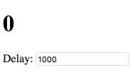

# Делаем setInterval декларативным с помощью React Hooks #

Если вы играли с [React Hooks](https://reactjs.org/docs/hooks-intro.html "React-docs") более нескольких часов, вы, вероятно, столкнулись с интригующей проблемой: использование setInterval [не работает](https://stackoverflow.com/questions/53024496/state-not-updating-when-using-react-state-hook-within-setinterval "StackOverflow - State not updating when using React state hook within setInterval") так, как вы ожидаете.

[По словам](https://mobile.twitter.com/ryanflorence/status/1088606583637061634 "Twitter - Ryan Florence") Ryan Florence:

>У меня было много людей, указывающих на setInterval с хукамии, как на яйце на лице React.

Честно говоря, я думаю, что у этих людей есть смысл. Сначала это сбивает с толку.

Но я также пришел к выводу, что это не недостаток хуков, а несоответствие между [моделью программирования React](https://overreacted.io/react-as-a-ui-runtime/ "Dan Abramov - React as a UI Runtime") и `setInterval`. Хуки, будучи ближе к модели программирования React, чем к классам, делают это несоответствие более заметным

**Есть способ заставить их работать вместе очень хорошо, но это немного не интуитивно понятно.**

В этом посте мы рассмотрим, как сделать интервалы и Hooks, и заставить из работать  вместе, почему это решение имеет смысл, и какие новые возможности оно может дать вам.

<hr>

**Отказ от ответственности: этот пост посвящен** ***патологическому случаю***. **Даже если API упрощает сотню вариантов использования, обсуждение всегда будет сосредоточено на том, что стало сложнее.**

Если вы новичок в Hooks и не понимаете, о чем идет речь, ознакомьтесь [с этим введением](https://medium.com/@dan_abramov/making-sense-of-react-hooks-fdbde8803889 "Dan Abramov - Making Sense of React Hooks") и [документацией](https://reactjs.org/docs/hooks-intro.html "React-docs"). В этом посте предполагается, что вы работали с Hooks более часа.

<hr>

## Просто покажи мне код ##

Без лишних слов, вот счетчик, который увеличивается каждую секунду:

```javascript
import React, { useState, useEffect, useRef } from 'react';

function Counter() {
  let [count, setCount] = useState(0);

  useInterval(() => {
    // Your custom logic here
    setCount(count + 1);
  }, 1000);

  return <h1>{count}</h1>;
}
```
Здесь [CodeSandbox demo.](https://codesandbox.io/s/105x531vkq "CodeSandbox").

Этот useInterval не является встроенным React Hook; это [custom Hook](https://reactjs.org/docs/hooks-custom.html), который я написал:

```javascript
import React, { useState, useEffect, useRef } from 'react';

function useInterval(callback, delay) {
  const savedCallback = useRef();

  // Remember the latest callback.
  useEffect(() => {
    savedCallback.current = callback;
  }, [callback]);

  // Set up the interval.
  useEffect(() => {
    function tick() {
      savedCallback.current();
    }
    if (delay !== null) {
      let id = setInterval(tick, delay);
      return () => clearInterval(id);
    }
  }, [delay]);
}
```
Здесь [CodeSandbox demo.](https://codesandbox.io/s/105x531vkq "CodeSandbox").

**Мой `useInterval` Hook устанавливает интервал и очищает его после размонтирования.** Это комбинация `setInterval` и `clearInterval`, привязанная к жизненному циклу компонента.

Не стесняйтесь скопировать, вставить его в свой проект или поставить на npm.

**Если вам все равно, как это работает, вы можете перестать читать сейчас! Остальная часть поста в блоге предназначена для людей, которые готовы глубоко погрузиться в React Hooks.**

<hr/>

## Чего ждать?! ##

Я знаю, о чем вы думаете:

>Дэн, этот код не имеет никакого смысла. Что случилось с «Просто JavaScript»? Признайте, что Реакт перепрыгнул акулу с Hooks (Крючками)!

**Я тоже так думал, но передумал и собираюсь изменить свое мнение.** Прежде чем объяснить, почему этот код имеет смысл, я хочу показать, на что он способен.

<hr/>

## Почему `useInterval ()` - лучший API ##

Напомню, что мой `useInterval` Hook принимает функцию и задержку:

```javascript
  useInterval(() => {
    // ...
  }, 1000);
```
Это очень похоже на setInterval:

```javascript
  setInterval(() => {
    // ...
  }, 1000);
```
**Так почему бы просто не использовать setInterval напрямую?**

Поначалу это может быть неочевидно, но разница между известным вам `setInterval` и моим хаком `useInterval` заключается в том, что его **аргументы являются «динамическими»**.

Я проиллюстрирую это на конкретном примере.

Допустим, мы хотим, чтобы задержка интервала была регулируемой:



Несмотря на то, что вы не обязательно управляете задержкой с помощью ввода, динамическая настройка может быть полезной - например, реже запрашивать обновления AJAX, пока пользователь переключается на другую вкладку.

Итак, как бы вы сделали это с setInterval в классе? Я закончил с этим:

```javascript
class Counter extends React.Component {
  state = {
    count: 0,
    delay: 1000,
  };

  componentDidMount() {
    this.interval = setInterval(this.tick, this.state.delay);
  }
  componentDidUpdate(prevProps, prevState) {
    if (prevState.delay !== this.state.delay) {
      clearInterval(this.interval);
      this.interval = setInterval(this.tick, this.state.delay);
    }
  }
  componentWillUnmount() {
    clearInterval(this.interval);
  }
  tick = () => {
    this.setState({
      count: this.state.count + 1
    });
  }

  handleDelayChange = (e) => {
    this.setState({ delay: Number(e.target.value) });
  }

  render() {
    return (
      <>
        <h1>{this.state.count}</h1>
        <input value={this.state.delay} onChange={this.handleDelayChange} />
      </>
    );
  }
}
```
Здесь [CodeSandbox demo.](https://codesandbox.io/s/mz20m600mp "CodeSandbox").

Это не так уж плохо!

Как выглядит версия Hook?

🥁🥁🥁
```javascript
function Counter() {
  let [count, setCount] = useState(0);
  let [delay, setDelay] = useState(1000);

  useInterval(() => {
    // Your custom logic here
    setCount(count + 1);
  }, delay);

  function handleDelayChange(e) {
    setDelay(Number(e.target.value));
  }

  return (
    <>
      <h1>{count}</h1>
      <input value={delay} onChange={handleDelayChange} />
    </>
  );
}
```
Здесь [CodeSandbox demo.](https://codesandbox.io/s/329jy81rlm "CodeSandbox").

Да, это _все, что нужно_.

В отличие от версии класса, в «обновлении» примера ловушки `useInterval` отсутствует разрыв для получения динамически настраиваемой задержки:

```javascript
  // Constant delay
  useInterval(() => {
    setCount(count + 1);
  }, 1000);

  // Adjustable delay
  useInterval(() => {
    setCount(count + 1);
  }, delay);
```
Когда `useInterval` Hook видит другую задержку, он снова устанавливает интервал.

**Вместо того чтобы писать код для установки и** ***очистки***  **интервала, я могу объявить интервал с определенной задержкой - и наш `useInterval` Hook делает это возможным.**

Что если я хочу _временно приостановить_ свой интервал? Я могу сделать это со state тоже:

```javascript
  const [delay, setDelay] = useState(1000);
  const [isRunning, setIsRunning] = useState(true);

  useInterval(() => {
    setCount(count + 1);
  }, isRunning ? delay : null);
```
Здесь [CodeSandbox demo.](https://codesandbox.io/s/l240mp2pm7 "CodeSandbox").

Это то, что вдохновляет меня на Hooks и React снова и снова. Мы можем обернуть существующие императивные API и создать декларативные API, более близко выражающие наши намерения. Как и в случае с рендерингом, мы можем одновременно **описывать процесс во все моменты времени** вместо того, чтобы аккуратно выдавать команды для его манипулирования.

<hr/>

Я надеюсь, что благодаря этому вы продаете на `useInterval ()` Hook, который является более приятным API - по крайней мере, когда мы делаем это из компонента.

**Но почему использование `setInterval ()` и `clearInterval ()` раздражает хуки?** Давайте вернемся к нашему примеру и попробуем реализовать его вручную.

<hr/>

## Первая попытка ##

Я начну с простого примера, который просто отображает исходное состояние:

```javascript
function Counter() {
  const [count, setCount] = useState(0);
  return <h1>{count}</h1>;
}
```
Теперь я хочу интервал, который увеличивает его каждую секунду. Это [побочный эффект](https://reactjs.org/docs/hooks-effect.html#effects-with-cleanup "React-docs Effects with Cleanup"), который [требует очистки](https://reactjs.org/docs/hooks-effect.html#effects-with-cleanup "React-docs Effects with Cleanup"), поэтому я собираюсь использовать Effect () и вернуть функцию очистки:

```javascript
function Counter() {
  let [count, setCount] = useState(0);

  useEffect(() => {
    let id = setInterval(() => {
      setCount(count + 1);
    }, 1000);
    return () => clearInterval(id);
  });

  return <h1>{count}</h1>;
}
```
Здесь [CodeSandbox demo.](https://codesandbox.io/s/7wlxk1k87j "CodeSandbox").

Кажется достаточно просто? Этот вид работ.

**Однако, этот код имеет странное поведение.**

React по умолчанию повторно применяет эффекты после каждого рендера. Это сделано намеренно и помогает избежать [целого класса ошибок](https://reactjs.org/docs/hooks-effect.html#explanation-why-effects-run-on-each-update "React-docs Explanation: Why Effects Run on Each Update"), присутствующих в компонентах класса React.

Обычно это хорошо, потому что многие API-интерфейсы подписки могут удачно удалить старый и добавить новый прослушиватель в любое время. Однако `setInterval` не является одним из них. Когда мы запускаем `clearInterval` и `setInterval`, их сроки меняются. Если мы слишком часто перерисовываем и повторно применяем эффекты, интервал никогда не будет получен!

Мы можем увидеть ошибку, перерисовав наш компонент в _меньший_ интервал:

```javascript
setInterval(() => {
  // Re-renders and re-applies Counter's effects
  // which in turn causes it to clearInterval()
  // and setInterval() before that interval fires.
  ReactDOM.render(<Counter />, rootElement);
}, 100);
```
Здесь [CodeSandbox demo.](https://codesandbox.io/s/9j86r218y4 "CodeSandbox").

<hr/>

## Вторая попытка ##


Автор статьи [Dan Abramov](https://overreacted.io/making-setinterval-declarative-with-react-hooks/) Оригинал статьи доступен по ссылке.<br/> Автор перевода [Yaroslav Kolesnikov](https://github.com/YaroslavW)