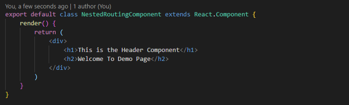
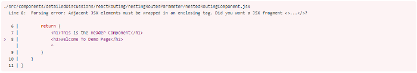

# 21 техника оптимизации производительности для React.


Статья посвящена оптимизации производительности приложения React. React предлагает множество оптимизаций для проектирования высокопроизводительных приложений, чего можно достичь, следуя некоторым из этих передовых методов.

Родительский и дочерний компоненты часто перерисовываются в следующем сценарии:

1. **Когда «setState» вызывается** в том же компоненте или родительском компоненте.
2. **Изменение значения «props»**, полученного от родителя.
3. Вызов `forceUpdate` в компоненте.

Ниже приведены 21 методика, которую мы можем использовать для повышения производительности наших приложений React.

## 1. Использование чистых компонентов

Компонент React можно считать чистым, если он выдает одинаковые выходные данные для того же состояния и реквизита. Для таких компонентов класса React предоставляет базовый класс `PureComponent`. Компоненты класса, расширяющие класс `React.PureComponent`, рассматриваются как чистые компоненты.

Это то же самое, что и обычный компонент, за исключением того факта, что `PureComponents` заботится о `shouldComponentUpdate` - он выполняет *поверхностное сравнение* состояния и данных реквизита - props. Если предыдущее состояние и данные реквизита совпадают со следующими реквизитами или состоянием, компонент не визуализируется повторно.

### Что такое неглубокий рендеринг.

При сравнении предыдущих реквизитов - props и состояния - state со следующим, поверхностное сравнение проверит, что примитивы имеют одинаковое значение (например, `1` равно `1` или что `true` равно `true`) и что *ссылки (references)* одинаковы между более сложными значениями JavaScript, такими как объекты и массивы.

Сравнение примитивных и объектных ссылок является более дешевой операцией, чем обновление представления компонента. Поэтому поиск изменений в состоянии и значениях реквизита будет выполняться быстрее, а не делать ненужные обновления.

```javascript

import React from 'react';

export default class ApplicationComponent extends React.Component {

    constructor() {
        super();
        this.state = {
            name: "Mayank"
        }
    }

    updateState = () => {
        setInterval(() => {
            this.setState({
                name: "Mayank"
            })
        }, 1000)
    }

    componentDidMount() {
        this.updateState();
    }

    render() {

        console.log("Render Called Again")
        return (
            <div>
                <RegularChildComponent name={this.state.name} />
                <PureChildComponent name={this.state.name} />
            </div>
        )
    }
}

class RegularChildComponent extends React.Component {
    render() {
        console.log("Regular Component Rendered..");
        return <div>{this.props.name}</div>;
    }
}

class PureChildComponent extends React.PureComponent {
    
    // Pure Components are the components that do not re-render if the State data or props data is still the same   
    
    render() {
        console.log("Pure Component Rendered..")
        return <div>{this.props.name}</div>;
    }
}
```

В приведенном выше примере состояние распространяется на дочерние компоненты `RegularChildComponent` и `PureChildComponent`. `PureChildComponent` является чистым компонентом. После интервала в 1 секунду вызывается `setState`, который повторно запускает рендеринг представления для компонента, поскольку начальные значения и новые значения параметров одинаковы, компонент (`PureChildComponent`) не будет повторно отображаться.

Неглубокое сравнение состояния показывает, что никаких изменений в данных нет ни для реквизита, ни для состояния, поэтому компонент не нужно визуализировать. Следовательно, делая компонент более эффективным.

## 2. Используйте React.memo для запоминания компонентов.

`React.memo` является компонентом высшего порядка. Он похож на `PureComponent`, но `PureComponent` относится к реализации класса для `Component`, тогда как **«memo»** используется для создания функциональных компонентов.

Подобно чистым компонентам, если входные свойства одинаковы, рендеринг компонента будет пропущен, что сделает компонент более быстрым и эффективным. Он запоминает результаты последнего выполнения для определенных входных параметров и повышает производительность приложения. Даже в этих компонентах сравнение невелико. Вы также можете передать пользовательскую логику сравнения для этого компонента.

Пользовательская логика может позволить пользователю искать *глубокое сравнение* объекта, если функция сравнения возвращает `false`, компонент будет перерисован, в противном случае перерисовка компонента отсутствует.

```javascript

function CustomisedComponen(props) {
    return (
        <div>
            <b>User name: {props.name}</b>
            <b>User age: {props.age}</b>
            <b>User designation: {props.designation}</b>
        </div>
    )
}

// The component below is the optimised version for the Default Componenent

// The Component will not re-render if same props value for "name" property 

var memoComponent = React.memo(CustomisedComponent);

```
Вышеупомянутый компонент будет выполнять *поверхностное сравнение* для предыдущего и следующего значения реквизита, в случаях, когда у нас есть ссылки на объекты, переданные в качестве реквизитов для компонента «memo», для сравнения должен быть установлен некоторый пользовательский логин, в таких случаях мы можем передать функцию сравнения в качестве второго параметра в функцию **«React.memo»**.

Предположим, что значение реквизита - props («user») является ссылкой на объект, содержащей «name», «age» и обозначение - «designation» для конкретного пользователя. В этом случае необходимо провести *глубокое сравнение*, мы можем создать пользовательскую функцию, которая ищет значение имени, возраста и назначения для предыдущего и следующего значения реквизита и возвращает `false`, если они не совпадают. Таким образом, наш компонент не будет повторно визуализироваться, даже если у нас есть справочные данные в качестве входных данных для компонента «memo».

```javascript

// The following function takes "user" Object as input parameter in props

function CustomisedComponen(props) {
    return (
        <div>
            <b>User name: {props.user.name}</b>
            <b>User age: {props.user.age}</b>
            <b>User designation: {props.user.designation}</b>
        </div>
    )
}

function userComparator(previosProps, nextProps) {
    if(previosProps.user.name == nextProps.user.name ||
       previosProps.user.age == nextProps.user.age ||
       previosProps.user.designation == nextProps.user.designation) {
        return false
    } else {
        return true;
    }
}

var memoComponent = React.memo(CustomisedComponent, userComparator);

```

В приведенном выше коде, мы представили пользовательскую логику для сравнения.

## 3. Использование события жизненного цикла `shouldComponentUpdate`.

Это одно из событий жизненного цикла, которое запускается перед повторной визуализацией компонента. Мы можем эффективно использовать это событие, чтобы решить, когда компонент должен быть перерисован. Эта функция возвращает логическое значение в случае, если компонент поддерживает изменения или вызывается setState. В обоих случаях компонент имеет тенденцию к повторной визуализации. Мы можем поместить собственную логику в это событие жизненного цикла, чтобы решить, будет ли вызвана функция рендеринга компонента.

Эта функция принимает в качестве входных данных `nextState` и `nextProps` и может сравнивать их с текущими реквизитами и состоянием, чтобы определить необходимость повторной визуализации.

### Давайте разберемся с помощью сценария:

Я хочу отобразить информацию о сотруднике на веб-странице, каждый сотрудник содержит несколько свойств, таких как имя, возраст, назначение, зарплата, текущий менеджер, предыдущий менеджер, бонус и т. Д. Из всех этих данных я хочу отобразить только имя и возраст для выбранного сотрудника на моей веб-странице. В какой-то момент времени назначение сотрудника обновляется, поскольку назначение сотрудника не является частью представления, в идеале представление не нужно обновлять. Мы можем добавить пользовательскую логику в компонент, чтобы увидеть, требуется ли компоненту обновлять представление или нет.

Посмотрим указанный сценарий с помощью программы:

```javascript

import React from "react";

export default class ShouldComponentUpdateUsage extends React.Component {

  constructor(props) {
    super(props);
    this.state = {
      name: "Mayank";
      age: 30,
      designation: "Architect";
    }
  }
  
  componentDidMount() {
    setTimeout(() => {
      this.setState({
        designation: "Senior Architect"
      });
    }
  }
               
  shouldComponentUpdate(nextProps, nextState) {
      if(nextState.age != this.state.age || netState.name = this.state.name) {
        return true;
      }
      return false;
  }
  
  render() {
    return (
      <div>
        <b>User Name:</b> {this.state.name}
        <b>User Age:</b> {this.state.age}
      </div>
    )
  }
}

```

Здесь, даже когда обозначение в компоненте меняется, это не повлияет на представление приложения. Поскольку вызывается `setState`, компонент имеет тенденцию к повторной визуализации, поскольку изменение «обозначения» - `designation` не изменяет / не влияет на представление компонента, поэтому повторная визуализация компонента при изменении обозначения будет непроизводительной. Чтобы избежать этих издержек, мы можем иметь собственную логику, чтобы проверить, обновляется ли имя или возраст, потому что на представление влияют только имя или возраст.

`shouldComponentUpdate` принимает входной параметр в качестве новых значений состояния и реквизита. Мы можем сравнить текущее и новое значение имени и возраста, если любое из них изменится, мы можем запустить повторную визуализацию. Передача «`true`» из `shouldComponentUpdate` уведомляет, что компонент может быть повторно обработан и наоборот. Так что, если `shouldComponentUpdate` используется правильно, мы можем оптимизировать производительность компонента приложения.

Сравнивая начальные состояния и свойства, мы можем принять решение о том, нужно ли повторно визуализировать компонент или нет. И это повысит производительность приложения, сделав меньше циклов повторного рендеринга.

## 4. Использование отложенной загрузки компонентов

Building - это процесс импорта и объединения нескольких файлов в один файл, так что приложению не нужно импортировать много внешних файлов. Все основные компоненты и внешние зависимости объединяются в один файл и отправляются по сети для построения и запуска веб-приложения. Это экономит много сетевых вызовов, но также приводит к проблеме, когда этот единственный файл становится большим файлом и потребляет большую пропускную способность сети. Приложение продолжает ожидать загрузки и выполнения этого большого файла, поэтому задержка передачи этого файла по сети приводит к увеличению времени рендеринга приложения.

Чтобы решить эту проблему, можно включить концепцию «Разделение кода» - **Code Splitting**. Концепция разделения кода поддерживается такими пакетами, как Webpack, которые могут создавать несколько пакетов для приложения, которые можно динамически загружать во время выполнения.

Загрузка во время выполнения уменьшает размер исходного создаваемого пакета, мы можем планировать разбиение пакетов таким образом, чтобы компоненты, которые изначально не загружались в приложение, могли быть отложены для загрузки позже, когда они потребуются, это уменьшит размер основного пакета и уменьшит время загрузки приложения. Мы используем «Suspense» и «Lazy» для того же.

```javascript

import React, { lazy, Suspense } from "react";

export default class CallingLazyComponents extends React.Component {
  render() {
    
    var ComponentToLazyLoad = null;
    
    if(this.props.name == "Mayank") { 
      ComponentToLazyLoad = lazy(() => import("./mayankComponent"));
    } else if(this.props.name == "Anshul") {
      ComponentToLazyLoad = lazy(() => import("./anshulComponent"));
    }
    return (
        <div>
            <h1>This is the Base User: {this.state.name}</h1>
            <Suspense fallback={<div>Loading...</div>}>
                <ComponentToLazyLoad />
            </Suspense>
        </div>
    )
  }
}

```

В приведенном выше коде у нас есть условный оператор, который ищет значение реквизита и в соответствии с указанным условием загружает любой из двух компонентов основного компонента. Первоначальная загрузка обоих этих компонентов в основной комплект увеличит общий размер комплекта. В любой момент времени мы требуем, чтобы один из двух компонентов был представлен. Поэтому загрузка всех компонентов, которые могут быть добавлены или не добавлены в представление, приведет к снижению производительности. Мы можем лениво загружать компоненты, когда это необходимо, и эти компоненты являются частью отдельного чанка, загружаемого во время выполнения и повышающего общую производительность приложения.

Мы поймем это с помощью другого примера.

Давайте предположим, что есть 2 разных компонента, которые отображаются на основе того, вошел ли пользователь в систему или нет. Отображается любой из двух компонентов: «WelcomeCompoment» и «GuestComponents», в зависимости от того, вошел ли пользователь в систему или нет.

Вместо загрузки обоих компонентов в исходном файле комплекта мы можем отложить загрузку компонента на основе условия.

```javascript
import React, { lazy, Suspense } from "react";

export default class UserSalutation extends React.Component {

    render() {
        if(this.props.username !== "") {
          const WelcomeComponent = lazy(() => import("./welcomeComponent"));
          return (
              <div>
                  <Suspense fallback={<div>Loading...</div>}>
                      <WelcomeComponent />
                  </Suspense>
              </div>
          )
        } else {
            const GuestComponent = lazy(() => import("./guestComponent"));
            return (
                <div>
                    <Suspense fallback={<div>Loading...</div>}>
                        <GuestComponent />
                    </Suspense>
                </div>
            )
        }
    }
}

```

В приведенном выше коде мы могли бы предварительно загрузить оба вышеупомянутых компонента, используя ключевое слово `import` в верхней части компонента, но вместо предварительной загрузки компонентов «WelcomeCompoment» и «GuestComponents» мы делаем условную проверку, если имя пользователя существует или нет, и на основе указанного условия мы решаем, какой компонент требуется загрузить как отдельный пакет. Таким образом, исходный пакет не будет содержать оба этих компонента, новый пакет будет загружен на лету в соответствии с указанным условием.

Преимущества такого подхода:

1. Размер основного пакета уменьшится, поскольку «WelcomeCompoment» и «GuestComponents» не загружаются в начальный загруженный пакет и, следовательно, потребляют меньше сетевого времени для начальной загрузки пакета.

2. Отдельный запрос на загрузку необходимого компонента выполняется на лету в соответствии с указанным условием: отдельно загруженный пакет представляет собой небольшой файл пакета и загружается без особых задержек.

Мы можем посмотреть приложение и решить, какие из компонентов могут быть загружены позже, и, следовательно, сократить начальное время загрузки приложения.

## 5. Используйте React.Fragments, чтобы избежать дополнительных тегов

Использование фрагментов уменьшает количество дополнительных тегов, которые включены только для выполнения требования наличия общего родителя в компоненте React. В случае, когда пользователь создает новый компонент, каждый компонент должен иметь один родительский тег, 2 тега не могут находиться на родительском уровне, поэтому у нас должен быть общий тег сверху. Чтобы удовлетворить это требование, мы часто добавляем дополнительный тег в верхней части компонента. Смотрите пример ниже:



В указанном выше компоненте нам нужен дополнительный тег, чтобы иметь общий родительский элемент для визуализации компонента. Этот дополнительный `div` не имеет никакой другой цели, кроме как выступает в качестве родительского тега для компонента. Он добавлен только потому, что компонент не может иметь 2 родительских тега.

Наличие нескольких тегов на верхнем уровне приводит к следующей ошибке:



Поэтому, как формальность, нам нужен дополнительный тег, который инкапсулирует теги, которые находятся на одном уровне.

Чтобы решить проблему, мы можем заключить элементы во фрагменты, фрагмент не вводит никакого дополнительного тега в компонент, но он все еще предоставляет родителя для 2 смежных тегов, так что условие наличия одного родителя в верхний уровень компонента удовлетворено.

```javascript

export default class NestedRoutingComponent extends React.Component {
    render() {
        return (
            <>
                <h1>This is the Header Component</h1>
                <h2>Welcome To Demo Page</h2>
            </>
        )
    }
}

```

В приведенном выше коде нет дополнительного тега для включения тегов, что позволяет сэкономить приложению для визуализации дополнительных элементов на странице.

Пройдите по этой [ссылке](https://github.com/facebook/react/issues/2127?source=post_page--------------------------- "Add fragment API to allow returning multiple components from render") для получения дополнительной информации:

## 6. Не используйте определение встроенной функции - inline function.

Если мы используем встроенные функции (inline function), каждый раз, когда вызывается функция «рендеринга», создается новый экземпляр функции. Когда React выполняет проверку Virtual DOM, он каждый раз находит новый экземпляр функции, поэтому на этапе рендеринга он связывает новую функцию и оставляет старый экземпляр для сбора мусора. Таким образом, прямое связывание встроенной функции приводит к дополнительной работе с сборщиком мусора и привязке новой функции к DOM.

Ниже приведен пример встроенной функции в компоненте.

```javascript

import React from "react";

export default class InlineFunctionComponent extends React.Component {
  render() {
    return (
      <div>
        <h1>Welcome Guest</h1>
        <input type="button" onClick={(e) => { this.setState({inputValue: e.target.value}) }} value="Click For Inline Function" />
      </div>
    )
  }
}

```

Функция выше, создает встроенную функцию. Каждый раз, когда вызывается функция рендеринга, создается новый экземпляр функции, и функция рендеринга связывает новый экземпляр функции с кнопкой. Также последний экземпляр функции доступен для сборки мусора, что увеличивает нагрузку на приложение React.

Вместо использования встроенной функции предпочтительнее создать функцию внутри компонента и связать событие с этой функцией. Это не создаст отдельный экземпляр функции каждый раз, когда вызывается render. Для справки см. Компонент ниже.

```javascript

import React from "react";

export default class InlineFunctionComponent extends React.Component {
  
  setNewStateData = (event) => {
    this.setState({
      inputValue: e.target.value
    })
  }
  
  render() {
    return (
      <div>
        <h1>Welcome Guest</h1>
        <input type="button" onClick={this.setNewStateData} value="Click For Inline Function" />
      </div>
    )
  }
}

```

## 7. Избегайте асинхронных запросов в «`componentWillMount()`»

**«ComponentWillMount»** будет вызываться непосредственно перед визуализацией компонента. Хотя эта функция не используется много раз. Его можно использовать для настройки начальной конфигурации компонента, но это можно сделать с помощью самого метода «constructor». Метод не может получить доступ к элементам DOM, так как компонент все еще не смонтирован.

Хотя некоторые разработчики считают, что это функция, в которой могут выполняться вызовы API асинхронных данных, но это не дает никакой выгоды. Поскольку вызовы API являются асинхронными, компонент не ждет, пока API вернет данные, прежде чем вызывать функцию «рендеринга». Таким образом, компонент отображается без каких-либо данных при первоначальном отображении.

```javascript

import React from "react";
import axios from "axios";

export default class UsingAsyncInComponentWillMount extends React.Component {

  constructor() {
    this.state = {
      userData: null
    }
  }
  
  componentWillMount() {
    axios.get("someResourceUrl").then((data) => {
      this.setState({
        userData: data
      });
    });
  }
  
  render() {
    return (
      <>
        <b>UserName: {this.state.name}</b>
        <b>UserAge: {this.state.age}</b>
      </>
    )
  }
}

```

В приведенном выше коде мы выполняем асинхронный вызов для извлечения данных, поскольку вызов данных является асинхронным, для извлечения потребуется некоторое время. Во время получения данных React запускает функцию «рендеринга» для компонента. Поэтому первый вызываемый рендер все равно не будет содержать данные, необходимые для этого. Таким образом, первоначально компонент отображается с пустыми данными, а затем данные извлекаются и вызывается «setState», а компонент повторно отображается. Таким образом, нет большой пользы от выполнения вызовов ajax на этапе `componentWillMount`.

Мы должны избегать выполнения «асинхронных» запросов в этой функции, скорее такие функции и вызовы могут быть отложены до события жизненного цикла «`componentDidMount`».

* Примечание: «componentWillMount» устарел в React 16.3, поэтому, если вы работаете с последними версиями React, избегайте использования событий этого жизненного цикла

## 8. Функция Bind в начале конструктора.

Когда мы создаем функции в React, нам нужно привязать функцию к текущему контексту, используя ключевое слово «`bind`». Привязка может быть выполнена либо в конструкторе, либо в том месте, где мы привязываем эту функцию к элементу DOM. Разница между этими двумя не кажется большой, но влияние на производительность различно. Посмотрите код ниже для более подробной информации:

```javascript

import React from "react";

export default class DelayedBinding extends React.Component {
  constructor() {
    this.state = {
      name: "Mayank"
    }
  }
  
  handleButtonClick() {
    alert("Button Clicked: " + this.state.name)
  }
  
  render() {
    return (
      <>
        <input type="button" value="Click" onClick={this.handleButtonClick.bind(this)} />
      </>
    )
  }
}

```

В приведенном выше коде мы связываем функциональность с кнопкой во время связывания в функции «рендеринга». Проблема с кодом выше состоит в том, что каждый раз, когда вызывается функция рендеринга, создается и используется новая функция, связанная с текущим контекстом. Более эффективно использовать уже существующую функцию каждый раз при рендеринге, а не создавать новую функцию при каждом рендеринге. Давайте посмотрим ниже, как оптимизировать код для того же.

```javascript

import React from "react";

export default class DelayedBinding extends React.Component {
  constructor() {
    this.state = {
      name: "Mayank"
    }
    this.handleButtonClick = this.handleButtonClick.bind(this)
  }
  
  handleButtonClick() {
    alert("Button Clicked: " + this.state.name)
  }
  
  render() {
    return (
      <>
        <input type="button" value="Click" onClick={this.handleButtonClick} />
      </>
    )
  }
}

```

Приведенный выше код оптимизирует проблему воссоздания функции каждый раз, когда вызывается функция рендеринга. Вместо того, чтобы связывать функцию каждый раз при рендеринге, лучше переопределить функцию `handleButtonClick` функцией, связанной с текущим контекстом во время самого вызова конструктора. Это уменьшит накладные расходы на привязку функции к текущему контексту и повторное создание функции каждый раз при рендеринге. Следовательно, повышение производительности для приложения.

## 9. Стрелочные функции против связывания в конструкторах.

Использование функций стрелок является стандартной практикой при работе с классами. Если мы используем функции стрелок, контекст выполнения сохраняется. Нам не нужно привязывать функцию к контексту при ее вызове.

```javascript

import React from "react";

export default class DelayedBinding extends React.Component {
  constructor() {
    this.state = {
      name: "Mayank"
    }
  }
  
  handleButtonClick = () => {
    alert("Button Clicked: " + this.state.name)
  }
  
  render() {
    return (
      <>
        <input type="button" value="Click" onClick={this.handleButtonClick} />
      </>
    )
  }
}

```

Функция стрелки, кажется, является большим преимуществом, но с преимуществом, есть и обратная сторона, когда мы добавляем функцию стрелки, функция добавляется как экземпляр объекта, а не как свойство prototype класса. Это означает, что если мы повторно используем компонент несколько раз, для каждой функции будет создано несколько экземпляров этих функций, созданных из компонента.

Каждый компонент будет иметь отдельный экземпляр для этих функций, и его повторное использование будет уменьшено. Кроме того, поскольку это свойство объекта, а не свойство prototype, функции недоступны в цепочке наследования.

Таким образом, хотя функция со стрелкой кажется более полезной и простой в реализации, у нее есть свой недостаток. ***Лучший способ реализовать функции - это иметь привязку функции в конструкторе***, как указано выше.

## 10. Избегайте использования встроенного атрибута стиля.

В случае встроенных стилей браузер тратит гораздо больше времени на скриптинг и рендеринг. Много времени тратится на создание сценариев, потому что все, что нужно, чтобы отобразить все правила стиля, передаваемые фактическим свойствам CSS, что увеличивает время рендеринга для компонента.

```javascript

import React from "react";

export default class InlineStyledComponents extends React.Component {
  render() {
    return (
      <>
        <b style={{"backgroundColor": "blue"}}>Welcome to Sample Page</b>
      </>
    )
  }
}

```

В компоненте, созданном выше, у нас есть встроенные стили, прикрепленные к компоненту. Добавленный встроенный стиль является объектом JavaScript вместо тега стиля. Стиль «`backgroundColor`» необходимо преобразовать в эквивалентное свойство стиля CSS, после чего стиль будет применен. Это включает в себя сценарии и выполнение JavaScript. ***Лучший способ - импортировать файл CSS в компоненте***.

