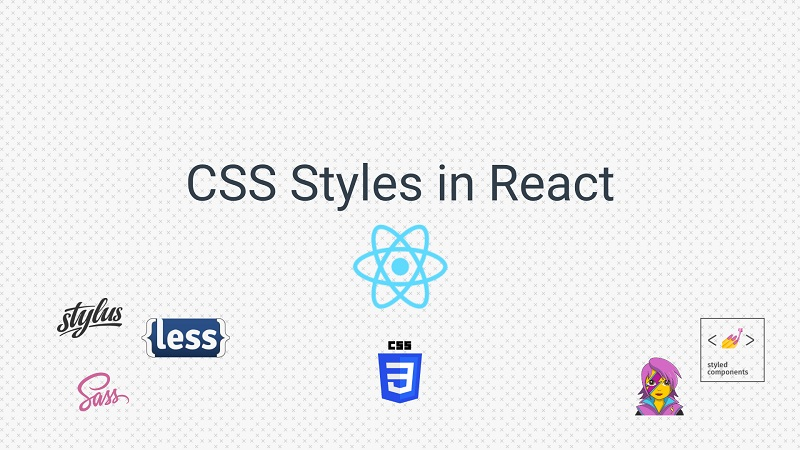

# 5 способов написания стилей CSS в React.js

В этом руководстве мы рассмотрим способы стилизации компонентов React. Мы покажем вам 5 разных способов, и вы решите, какой из них вы предпочитаете!



## Стиль вашего компонента.

Вот способы стилизации компонентов, которые мы обсудим:

* [Regular CSS](##RegularCSS)

* [Inline Styling]()

* [CSS Modules]()

* [Preprocessors]()

* [CSS in JS]()

Мы собираемся заменить стили, приведенные ниже, используя разные способы стилизации компонентов.

```css 
/* BeautifulButton.css */

.button {
  color: #494949;
  text-transform: uppercase;
  text-decoration: none;
  background: #ffffff;
  padding: 20px;
  font-size: 20px;
  border: 4px solid #494949;
  display: inline-block;
  transition: all 0.4s ease 0s;
}

.button:hover {
  color: #ffffff;
  background: #f6b93b;
  border-color: #f6b93b;
  transition: all 0.4s ease 0s;
}

.button--primary {
  color: #ffffff;
  text-transform: uppercase;
  text-decoration: none;
  background: #f6b93b;
  padding: 20px;
  font-size: 20px;
  border: 4px solid #f6b93b;
  display: inline-block;
  transition: all 0.4s ease 0s;
}

.button--primary:hover {
  color: #494949;
  background: #ffffff;
  border-color: #494949;
  transition: all 0.4s ease 0s;
}
```
---

## Regular CSS