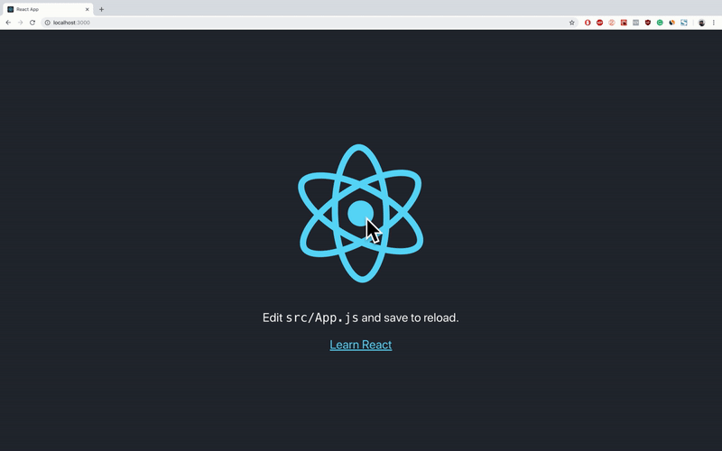

# Как использовать Redux в ReactJS с реальными примерами.


## Создание нового проекта на основе ReactJS и добавление в него Redux.

Перво-наперво давайте создадим новое react-приложение, перейдем к нему и запустим.

```
create-react-app react-redux-tutorial
cd react-redux-tutorial
npm start
```


<center><small>вывод по умолчанию create-react-app после npm start</small></center>

Как мы видим, приложение create-react-app приложение предоставляет нам очень простой шаблон с абзацем текста, ссфлкой и привязкой к веб-сайту React, с вращением официального значка ReactJS.

Друзья, я не сказал вам, для чего мы будем использовать Redux, или что мы здесь делаем. И это потому, что мне нужно изображение GIF выше.

Чтобы сделать эту учебную статью легкой и понятной, мы не собираемся создавать что-то очень сложное. Мы будем использовать Redux, чтобы изображение React остановилось или начало вращаться.

Итак, как говорится, давайте продолжим и добавим следующие пакеты Redux:

```
npm install --save redux react-redux
```

### [redux v4.0.1](https://redux.js.org/)

- В общем смысле Redux делает то, что он создает глобальное состояние для всего приложения, к которому может обращаться любой ваш компонент.
- Это библиотека управления состоянием.
- У вас есть только одно состояние для всего вашего приложения, а не состояния для каждого из ваших компонентов.

### [react-redux v5.1.1](https://www.npmjs.com/package/react-redux)

- Это используется для того, чтобы мы могли получить доступ к данным Redux и изменить их, отправив действия в Redux - на самом деле это не Redux, но мы получим.
- По официальной документации `state`: _позволяет компонентам React считывать данные из хранилища Redux и отправлять действия в хранилище для обновления данных._

> ПРИМЕЧАНИЕ. Если у вас возникли проблемы с приведенной выше командой, попробуйте установить пакеты отдельно.

При работе с Redux вам понадобятся три основных момента:

- [actions](https://redux.js.org/basics/actions): это объекты, которые должны иметь два свойства, одно из которых описывает **тип действия**, а другое описывает, **что следует изменить** в состоянии приложения.

- [reducers](https://redux.js.org/basics/reducers): это функции, которые реализуют **поведение действий**. Они изменяют состояние приложения на основе описания действия и описания изменения состояния.

- [store](https://redux.js.org/basics/store): он объединяет actions и reducers, **удерживая и изменяя состояние** всего приложения - существует только одино хранилище - store.

Как я уже говорил выше, мы будем останавливать и оять запускать логотип React. Это означает, что нам понадобятся два действия:

1 — Linux / Mac commands

```
mkdir src/actions
touch src/actions/startAction.js
touch src/actions/stopAction.js
```

2 — Windows commands

```
mkdir src\actions
echo "" > src\actions\startAction.js
echo "" > src\actions\stopAction.js
```

Теперь давайте отредактируем файл `src/actions/startAction.js` следующим образом:

```javascript
export const startAction = {
  type: "rotate",
  payload: true
};
```

Итак, мы собираемся сказать нашему reducer, что тип действия - это вращение (rotate) логотипа React. И состояние поворота логотипа React должно быть изменено на `true` - мы хотим, чтобы логотип начал вращаться.

Теперь давайте отредактируем файл `src/actions/stopAction.js` следующим образом:

```javascript
export const stopAction = {
  type: "rotate",
  payload: false
};
```

Итак, мы собираемся сказать нашему reducer, что тип действия - это вращение (rotate) логотипа React. И состояние поворота логотипа React должно быть изменено на `false`- мы хотим, чтобы логотип перестал вращаться.

Давайте также создадим reducer для нашего приложения:

1 — Linux / Mac commands

```
mkdir src/reducers
touch src/reducers/rotateReducer.js
```

2 — Windows commands

```
mkdir src\reducers
echo "" > src\reducers\rotateReducer.js
```

И добавьте в него следующий код:

```javascript
export default (state, action) => {
  switch (action.type) {
    case "rotate":
      return {
        rotating: action.payload
      };
    default:
      return state;
  }
};
```

Таким образом, редуктор получит оба наших действия, оба из которых имеют тип `rotate`, и они оба изменяют одно и то же состояние в приложении - которое является `state.rotating`. В зависимости от полезности этих действий `state.rotating` изменится на `true` или `false`.

Я добавил `default` case, который будет сохранять состояние неизменным, если тип действия не `rotate`. Значение по умолчанию есть в случае, если мы создаем действие, и мы забываем добавить `case`- случай для этого действия. Таким образом, мы не удаляем все состояние приложения - мы просто ничего не делаем и сохраняем то, что имели.

Идем далее и выполним следующие команды:

1 — Linux / Mac command

```
touch src/store.js
```

2 — Windows command

```
echo "" > src\store.js
```

И также добавьте в него следующий код:

```javascript
import { createStore } from "redux";
import rotateReducer from "reducers/rotateReducer";

function configureStore(state = { rotating: true }) {
  return createStore(rotateReducer, state);
}

export default configureStore;
```

Итак, мы создаем функцию с именем `configureStore`, в которую мы отправляем состояние по умолчанию, и мы создаем наше хранилище, используя созданный редуктор и состояние по умолчанию.

Я не уверен, что вы видели мои импорты, они используют абсолютные пути, поэтому у вас могут возникнуть некоторые ошибки из-за этого. Исправление для этого является одним из двух:

Первое:
1 - Добавьте файл `.env` в ваше приложение следующим образом:

```
echo "NODE_PATH=./src" > .env
```

Или:
2 - Установите cross-env глобально и измените стартовый скрипт из файла package.json следующим образом:

```
npm install -g cross-env
```

Добавить в `package.json`

```json
"start": "NODE_PATH=./src react-scripts start",
```

Теперь, когда мы настроили наше хранилище - `store`, наши действия - `action` и наш редуктор - `reducer`, нам нужно добавить новый класс в файл `src/App.css.` Этот класс приостановит вращающуюся анимацию логотипа.

Итак, мы собираемся написать следующее внутри `src/App.css`:

```css
.App-logo-paused {
  animation-play-state: paused;
}
```

Итак, ваш файл `App.css` должен выглядеть примерно так:

```css
.App {
  text-align: center;
}

.App-logo {
  animation: App-logo-spin infinite 20s linear;
  height: 40vmin;
}

/* new class here */
.App-logo-paused {
  animation-play-state: paused;
}

.App-header {
  background-color: #282c34;
  min-height: 100vh;
  display: flex;
  flex-direction: column;
  align-items: center;
  justify-content: center;
  font-size: calc(10px + 2vmin);
  color: white;
}

.App-link {
  color: #61dafb;
}

@keyframes App-logo-spin {
  from {
    transform: rotate(0deg);
  }
  to {
    transform: rotate(360deg);
  }
}
```

Теперь нам нужно только изменить наш файл `src/App.js`, чтобы он слушал состояние нашего хранилища - store. А при нажатии на логотип он вызывает одно из действий - actions запуска или остановки.

Перво-наперво, нам нужно подключить наш компонент к нашему хранилищу резервов, для этого мы импортируем `connect` из `react-redux`.

```javascript
import { connect } from "react-redux";
```
После этого мы экспортируем наш компонент приложения с помощью метода `connect` следующим образом:

```javascript
export default connect()(App);
```
Чтобы изменить состояние хранилища redux, нам понадобятся действия - `actions`, которые мы сделали ранее, поэтому давайте импортируем их также:

```javascript
import { startAction } from "actions/startAction";
import { stopAction } from "actions/stopAction";
```
Теперь нам нужно извлечь состояние из нашего хранилища и сказать, что мы хотим, чтобы действия `start` и `stop` использовались для изменения состояния.

Это будет сделано с помощью функции подключения - `connect`, которая принимает два параметра:

* `mapStateToProps` - это используется для получения состояния `store`.

* `mapDispatchToProps` - используется для извлечения действий -`actions` и отправки их в хранилище - `store`.

Итак, давайте напишем в нашем `App.js` (в конце файла):

```javascript
const mapStateToProps = state => ({
  ...state
});

const mapDispatchToProps = dispatch => ({
  startAction: () => dispatch(startAction),
  stopAction: () => dispatch(stopAction)
});
```
После этого давайте добавим их в нашу функцию подключения - `connect` следующим образом:

```javascript
export default connect(mapStateToProps, mapDispatchToProps)(App);
```
И прямо сейчас, внутри нашего компонента `App`, мы можем получить доступ к состоянию `store`, `startAction` и `stopAction` через `props`.

Давайте изменим тег `img` на:

```javascript

```
Итак, здесь мы говорим, что если состояние - store вращения - rotating  (`this.props.rotating`) истинно - `true`, то мы хотим, чтобы только имя класса приложения `App-logo` было установлено на наш `img`. Если это неверно, то мы также хотим, чтобы класс `app-logo-paused` был установлен в `className`. Таким образом, мы приостанавливаем анимацию.

Кроме того, если `this.props.rotating` имеет значение `true`, то мы хотим отправить в нашем store функцию `onClick` и изменить его обратно на `false`, и наоборот.

Мы почти закончили, но мы кое-что забыли.

Мы еще не сказали нашему приложению, что у нас есть глобальное состояние, или, если хотите, что мы используем управление redux состоянием.

Для этого мы заходим в `src/index.js`, мы импортируем провайдера из response-redux и вновь созданное хранилище, например, так:

```javascript
import { Provider } from "react-redux";

import configureStore from "store";
```
* [Provider](https://react-redux.js.org/api/provider): делает хранилище Redux доступным для любых вложенных компонентов, обернутых в функцию `connect`.

После этого вместо прямой визуализации нашего компонента приложения мы отображаем его через нашего провайдера, используя созданный нами store следующим образом:

```javascript
ReactDOM.render(
  <Provider store={configureStore()}>
    <App />
  </Provider>,
  document.getElementById('root')
);
```
Здесь мы могли бы использовать функцию `configureStore` с некоторым другим состоянием, например `configureStore({ rotating: false })`.

Итак, ваш `index.js` должен выглядеть так:

```javascript
import React from 'react';
import ReactDOM from 'react-dom';
// new imports start
import { Provider } from "react-redux";

import configureStore from "store";
// new imports stop

import './index.css';

import App from './App';
import * as serviceWorker from './serviceWorker';

// changed the render
ReactDOM.render(
  <Provider store={configureStore()}>
    <App />
  </Provider>,
  document.getElementById('root')
);
// changed the render

serviceWorker.unregister();
```
Давайте пойдем дальше и посмотрим, работает ли наше приложение на Redux:


<center><small>React & Redux в действии</small></center>

## Использование создателей действий.
