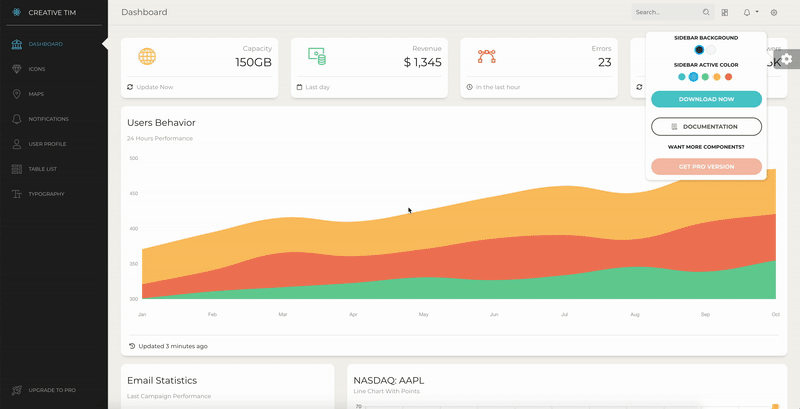
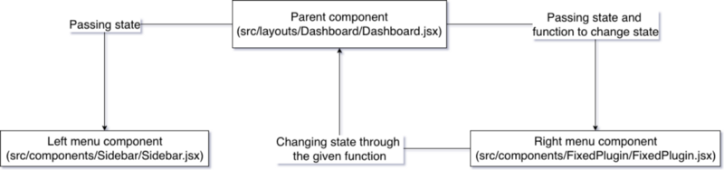
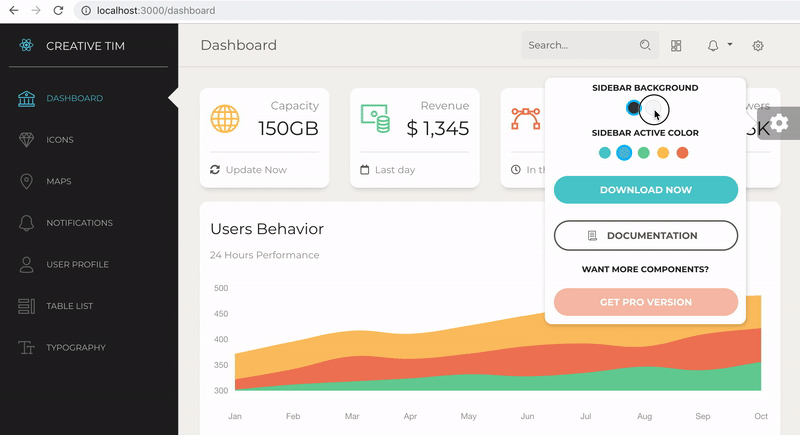

# Как использовать Redux в ReactJS с реальными примерами.


## Создание нового проекта на основе ReactJS и добавление в него Redux.

Перво-наперво давайте создадим новое react-приложение, перейдем к нему и запустим.

```
create-react-app react-redux-tutorial
cd react-redux-tutorial
npm start
```


<center><small>вывод по умолчанию create-react-app после npm start</small></center>

Как мы видим, приложение create-react-app приложение предоставляет нам очень простой шаблон с абзацем текста, ссфлкой и привязкой к веб-сайту React, с вращением официального значка ReactJS.

Друзья, я не сказал вам, для чего мы будем использовать Redux, или что мы здесь делаем. И это потому, что мне нужно изображение GIF выше.

Чтобы сделать эту учебную статью легкой и понятной, мы не собираемся создавать что-то очень сложное. Мы будем использовать Redux, чтобы изображение React остановилось или начало вращаться.

Итак, как говорится, давайте продолжим и добавим следующие пакеты Redux:

```
npm install --save redux react-redux
```

### [redux v4.0.1](https://redux.js.org/)

- В общем смысле Redux делает то, что он создает глобальное состояние для всего приложения, к которому может обращаться любой ваш компонент.
- Это библиотека управления состоянием.
- У вас есть только одно состояние для всего вашего приложения, а не состояния для каждого из ваших компонентов.

### [react-redux v5.1.1](https://www.npmjs.com/package/react-redux)

- Это используется для того, чтобы мы могли получить доступ к данным Redux и изменить их, отправив действия в Redux - на самом деле это не Redux, но мы получим.
- По официальной документации `state`: _позволяет компонентам React считывать данные из хранилища Redux и отправлять действия в хранилище для обновления данных._

> ПРИМЕЧАНИЕ. Если у вас возникли проблемы с приведенной выше командой, попробуйте установить пакеты отдельно.

При работе с Redux вам понадобятся три основных момента:

- [actions](https://redux.js.org/basics/actions): это объекты, которые должны иметь два свойства, одно из которых описывает **тип действия**, а другое описывает, **что следует изменить** в состоянии приложения.

- [reducers](https://redux.js.org/basics/reducers): это функции, которые реализуют **поведение действий**. Они изменяют состояние приложения на основе описания действия и описания изменения состояния.

- [store](https://redux.js.org/basics/store): он объединяет actions и reducers, **удерживая и изменяя состояние** всего приложения - существует только одино хранилище - store.

Как я уже говорил выше, мы будем останавливать и оять запускать логотип React. Это означает, что нам понадобятся два действия:

1 — Linux / Mac commands

```
mkdir src/actions
touch src/actions/startAction.js
touch src/actions/stopAction.js
```

2 — Windows commands

```
mkdir src\actions
echo "" > src\actions\startAction.js
echo "" > src\actions\stopAction.js
```

Теперь давайте отредактируем файл `src/actions/startAction.js` следующим образом:

```javascript
export const startAction = {
  type: "rotate",
  payload: true
};
```

Итак, мы собираемся сказать нашему reducer, что тип действия - это вращение (rotate) логотипа React. И состояние поворота логотипа React должно быть изменено на `true` - мы хотим, чтобы логотип начал вращаться.

Теперь давайте отредактируем файл `src/actions/stopAction.js` следующим образом:

```javascript
export const stopAction = {
  type: "rotate",
  payload: false
};
```

Итак, мы собираемся сказать нашему reducer, что тип действия - это вращение (rotate) логотипа React. И состояние поворота логотипа React должно быть изменено на `false`- мы хотим, чтобы логотип перестал вращаться.

Давайте также создадим reducer для нашего приложения:

1 — Linux / Mac commands

```
mkdir src/reducers
touch src/reducers/rotateReducer.js
```

2 — Windows commands

```
mkdir src\reducers
echo "" > src\reducers\rotateReducer.js
```

И добавьте в него следующий код:

```javascript
export default (state, action) => {
  switch (action.type) {
    case "rotate":
      return {
        rotating: action.payload
      };
    default:
      return state;
  }
};
```

Таким образом, редуктор получит оба наших действия, оба из которых имеют тип `rotate`, и они оба изменяют одно и то же состояние в приложении - которое является `state.rotating`. В зависимости от полезности этих действий `state.rotating` изменится на `true` или `false`.

Я добавил `default` case, который будет сохранять состояние неизменным, если тип действия не `rotate`. Значение по умолчанию есть в случае, если мы создаем действие, и мы забываем добавить `case`- случай для этого действия. Таким образом, мы не удаляем все состояние приложения - мы просто ничего не делаем и сохраняем то, что имели.

Идем далее и выполним следующие команды:

1 — Linux / Mac command

```
touch src/store.js
```

2 — Windows command

```
echo "" > src\store.js
```

И также добавьте в него следующий код:

```javascript
import { createStore } from "redux";
import rotateReducer from "reducers/rotateReducer";

function configureStore(state = { rotating: true }) {
  return createStore(rotateReducer, state);
}

export default configureStore;
```

Итак, мы создаем функцию с именем `configureStore`, в которую мы отправляем состояние по умолчанию, и мы создаем наше хранилище, используя созданный редуктор и состояние по умолчанию.

Я не уверен, что вы видели мои импорты, они используют абсолютные пути, поэтому у вас могут возникнуть некоторые ошибки из-за этого. Исправление для этого является одним из двух:

Первое:
1 - Добавьте файл `.env` в ваше приложение следующим образом:

```
echo "NODE_PATH=./src" > .env
```

Или:
2 - Установите cross-env глобально и измените стартовый скрипт из файла package.json следующим образом:

```
npm install -g cross-env
```

Добавить в `package.json`

```json
"start": "NODE_PATH=./src react-scripts start",
```

Теперь, когда мы настроили наше хранилище - `store`, наши действия - `action` и наш редуктор - `reducer`, нам нужно добавить новый класс в файл `src/App.css.` Этот класс приостановит вращающуюся анимацию логотипа.

Итак, мы собираемся написать следующее внутри `src/App.css`:

```css
.App-logo-paused {
  animation-play-state: paused;
}
```

Итак, ваш файл `App.css` должен выглядеть примерно так:

```css
.App {
  text-align: center;
}

.App-logo {
  animation: App-logo-spin infinite 20s linear;
  height: 40vmin;
}

/* new class here */
.App-logo-paused {
  animation-play-state: paused;
}

.App-header {
  background-color: #282c34;
  min-height: 100vh;
  display: flex;
  flex-direction: column;
  align-items: center;
  justify-content: center;
  font-size: calc(10px + 2vmin);
  color: white;
}

.App-link {
  color: #61dafb;
}

@keyframes App-logo-spin {
  from {
    transform: rotate(0deg);
  }
  to {
    transform: rotate(360deg);
  }
}
```

Теперь нам нужно только изменить наш файл `src/App.js`, чтобы он слушал состояние нашего хранилища - store. А при нажатии на логотип он вызывает одно из действий - actions запуска или остановки.

Перво-наперво, нам нужно подключить наш компонент к нашему хранилищу резервов, для этого мы импортируем `connect` из `react-redux`.

```javascript
import { connect } from "react-redux";
```

После этого мы экспортируем наш компонент приложения с помощью метода `connect` следующим образом:

```javascript
export default connect()(App);
```

Чтобы изменить состояние хранилища redux, нам понадобятся действия - `actions`, которые мы сделали ранее, поэтому давайте импортируем их также:

```javascript
import { startAction } from "actions/startAction";
import { stopAction } from "actions/stopAction";
```

Теперь нам нужно извлечь состояние из нашего хранилища и сказать, что мы хотим, чтобы действия `start` и `stop` использовались для изменения состояния.

Это будет сделано с помощью функции подключения - `connect`, которая принимает два параметра:

- `mapStateToProps` - это используется для получения состояния `store`.

- `mapDispatchToProps` - используется для извлечения действий -`actions` и отправки их в хранилище - `store`.

Итак, давайте напишем в нашем `App.js` (в конце файла):

```javascript
const mapStateToProps = state => ({
  ...state
});

const mapDispatchToProps = dispatch => ({
  startAction: () => dispatch(startAction),
  stopAction: () => dispatch(stopAction)
});
```

После этого давайте добавим их в нашу функцию подключения - `connect` следующим образом:

```javascript
export default connect(
  mapStateToProps,
  mapDispatchToProps
)(App);
```

И прямо сейчас, внутри нашего компонента `App`, мы можем получить доступ к состоянию `store`, `startAction` и `stopAction` через `props`.

Давайте изменим тег `img` на:

```javascript

```

Итак, здесь мы говорим, что если состояние - store вращения - rotating (`this.props.rotating`) истинно - `true`, то мы хотим, чтобы только имя класса приложения `App-logo` было установлено на наш `img`. Если это неверно, то мы также хотим, чтобы класс `app-logo-paused` был установлен в `className`. Таким образом, мы приостанавливаем анимацию.

Кроме того, если `this.props.rotating` имеет значение `true`, то мы хотим отправить в нашем store функцию `onClick` и изменить его обратно на `false`, и наоборот.

Мы почти закончили, но мы кое-что забыли.

Мы еще не сказали нашему приложению, что у нас есть глобальное состояние, или, если хотите, что мы используем управление redux состоянием.

Для этого мы заходим в `src/index.js`, мы импортируем провайдера из response-redux и вновь созданное хранилище, например, так:

```javascript
import { Provider } from "react-redux";

import configureStore from "store";
```

- [Provider](https://react-redux.js.org/api/provider): делает хранилище Redux доступным для любых вложенных компонентов, обернутых в функцию `connect`.

После этого вместо прямой визуализации нашего компонента приложения мы отображаем его через нашего провайдера, используя созданный нами store следующим образом:

```javascript
ReactDOM.render(
  <Provider store={configureStore()}>
    <App />
  </Provider>,
  document.getElementById("root")
);
```

Здесь мы могли бы использовать функцию `configureStore` с некоторым другим состоянием, например `configureStore({ rotating: false })`.

Итак, ваш `index.js` должен выглядеть так:

```javascript
import React from "react";
import ReactDOM from "react-dom";
// new imports start
import { Provider } from "react-redux";

import configureStore from "store";
// new imports stop

import "./index.css";

import App from "./App";
import * as serviceWorker from "./serviceWorker";

// changed the render
ReactDOM.render(
  <Provider store={configureStore()}>
    <App />
  </Provider>,
  document.getElementById("root")
);
// changed the render

serviceWorker.unregister();
```

Давайте пойдем дальше и посмотрим, работает ли наше приложение на Redux:


<center><small>React & Redux в действии</small></center>

## Использование создателей действий.

При желании вместо `actions` - действий мы можем использовать создателей действий- [action creators](https://redux.js.org/basics/actions#action-creators), которые являются функциями, создающими действия.

Таким образом, мы можем объединить наши два действия в одной функции и немного уменьшить наш код.

Итак, давайте продолжим и создадим новый файл:

1 — Linux / Mac command

```
touch src/actions/rotateAction.js
```

2 — Windows command

```
echo "" > src\actions\rotateAction.js
```

И добавьте этот код:

```javascript
const rotateAction = payload => {
  return {
    type: "rotate",
    payload
  };
};
export default rotateAction;
```

Мы собираемся отправить действие типа `rotate` с полезной нагрузкой, которую мы собираемся получить в компоненте App.

Внутри компонента `src/App.js` нам нужно импортировать нашего нового создателя действий:

```javascript
import rotateAction from "actions/rotateAction";
```

Добавьте новую функцию в `mapDispatchToProps` следующим образом:

`rotateAction`: получит (полезную нагрузку) и отправит `rotateAction` с полезной нагрузкой

Измените функцию `onClick` на:

```javascript
onClick={() => this.props.rotateAction(!this.props.rotating)}
```

И, наконец, добавьте нашего нового создателя действий в `mapDispatchToProps` следующим образом:

```javascript
rotateAction: payload => dispatch(rotateAction(payload));
```

Мы также можем удалить старый импорт для старых действий, а также удалить их из `mapDispatchToProps`.

Вот как должен выглядеть ваш новый `src/App.js`:

```javascript
import React, { Component } from "react";
// new lines from here
import { connect } from "react-redux";
import rotateAction from "actions/rotateAction";

//// new lines to here

import logo from "./logo.svg";
import "./App.css";

class App extends Component {
  render() {
    console.log(this.props);
    return (
      <div className="App">
        <header className="App-header">
           this.props.rotateAction(!this.props.rotating)}
          />
          <p>
            Edit <code>src/App.js</code> and save to reload.
          </p>
          <a
            className="App-link"
            href="https://reactjs.org"
            target="_blank"
            rel="noopener noreferrer"
          >
            Learn React
          </a>
        </header>
      </div>
    );
  }
}

const mapStateToProps = state => ({
  ...state
});
const mapDispatchToProps = dispatch => ({
  rotateAction: payload => dispatch(rotateAction(payload))
});

export default connect(
  mapStateToProps,
  mapDispatchToProps
)(App);
```

## Пример из реальной жизни с Paper Dashboard React.



<center><small>Paper Dashboard React </small></center>

Как вы увидите на картинке выше, я использую правое меню, чтобы изменить цвета меню слева. Это достигается путем использования состояний компонента и передачи этого состояния из родительского компонента в два меню и некоторые функции для изменения этого состояния.



<center><small>небольшая диаграмма того, как приложение работает в данный момент </small></center>

Я подумал, что это будет хороший пример, взять этот продукт и заменить состояния компонентов Redux.

Вы можете получить это этими 3 способами:

1. Загрузить с сайта [creative-tim.com](https://www.creative-tim.com/product/paper-dashboard-react)

2. Загрузить с [Github](https://github.com/creativetimofficial/paper-dashboard-react)

3. Клонировать репо с Github

```
git clone https://github.com/creativetimofficial/paper-dashboard-react.git
```
Теперь, когда у нас есть этот продукт, давайте перейдем к нему и снова установим redux и Reaction-redux:

```
npm install --save redux react-redux
```
После этого нам нужно создать действия - actions. Так как в правом меню у нас есть 2 цвета, которые устанавливают фон левого меню, и 5 цветов, которые меняют цвет ссылок, нам нужно 7 действий или 2 создателя действий - actions creator - и мы собираемся использовать этот второй вариант, так как он немного меньше кода для записи:

1 — Linux / Mac commands
```
mkdir src/actions
touch src/actions/setBgAction.js
touch src/actions/setColorAction.js
```
2 — Windows commands
```
mkdir src\actions
echo "" > src\actions\setBgAction.js
echo "" > src\actions\setColorAction.js
```
После этого давайте создадим код действий следующим образом:
`— src/actions/setBgAction.js`
```javascript
const setBgAction = (payload) => {
  return {
    type: "bgChange",
    payload
  }
}
export default setBgAction;
```

`— src/actions/setColorAction.js`
```javascript
const setColorAction = (payload) => {
  return {
    type: "colorChange",
    payload
  }
}
export default setColorAction;
```
Теперь, как и в первой части, нам нужен редуктор - reduser :

1 — Linux / Mac commands
```
mkdir src/reducers
touch src/reducers/rootReducer.js
```
2 — Windows commands
```
mkdir src\reducers
echo "" > src\reducers\rootReducer.js
```
И код для `rootReducer`:
```javascript
export default (state, action) => {
  switch (action.type) {
    case "bgChange":
      return {
        ...state,
        bgColor: action.payload
      };
    case "colorChange":
      return {
        ...state,
        activeColor: action.payload
      };
    default:
      return state;
  }
};
```
Как вы можете видеть здесь, в отличие от нашего первого примера, мы хотим сохранить наше старое состояние и обновить его содержимое.

Нам также нуженo `store` - хранилище:

1 — Linux / Mac command
```
touch src/store.js
```
2 — Windows command
```
echo "" > src\store.js
```
Код для этого:
```javascript
import { createStore } from "redux";
import rootReducer from "reducers/rootReducer";

function configureStore(state = { bgColor: "black", activeColor: "info" }) {
  return createStore(rootReducer,state);
}
export default configureStore;
```
Внутри `src/index.js` нам нужно:
```javascript
// new imports start
import { Provider } from "react-redux";

import configureStore from "store";
// new imports stop
```
А также измените функцию рендеринга:
```javascript
ReactDOM.render(
  <Provider store={configureStore()}>
    <Router history={hist}>
      <Switch>
        {indexRoutes.map((prop, key) => {
          return <Route path={prop.path} key={key} component={prop.component} />;
        })}
      </Switch>
    </Router>
  </Provider>,
  document.getElementById("root")
);
```
Таким образом, файл `index.js` должен выглядеть следующим образом:

```javascript
import React from "react";
import ReactDOM from "react-dom";
import { createBrowserHistory } from "history";
import { Router, Route, Switch } from "react-router-dom";
// new imports start
import { Provider } from "react-redux";

import configureStore from "store";
// new imports stop

import "bootstrap/dist/css/bootstrap.css";
import "assets/scss/paper-dashboard.scss";
import "assets/demo/demo.css";

import indexRoutes from "routes/index.jsx";

const hist = createBrowserHistory();

ReactDOM.render(
  <Provider store={configureStore()}>
    <Router history={hist}>
      <Switch>
        {indexRoutes.map((prop, key) => {
          return <Route path={prop.path} key={key} component={prop.component} />;
        })}
      </Switch>
    </Router>
  </Provider>,
  document.getElementById("root")
);
```
Теперь нам нужно внести некоторые изменения в `src/layouts/Dashboard/Dashboard.jsx`. Нам нужно удалить состояние и функции, которые меняют состояние. Итак, удалите эти биты кода:

Конструктор (между строками 16 и 22):

```javascript
constructor(props){
  super(props);
  this.state = {
    backgroundColor: "black",
    activeColor: "info",
  }
}
```
Функции состояния (между строками 41 и 46):
```javascript
handleActiveClick = (color) => {
    this.setState({ activeColor: color });
  }
handleBgClick = (color) => {
  this.setState({ backgroundColor: color });
}
```
Боковые панели - sidebar `bgColor` и `activeColor` (строки 53 и 54):
```javascript
bgColor={this.state.backgroundColor}
activeColor={this.state.activeColor}
```
Все `props` `FixedPlugin` (между строками 59–62):
```javascript
bgColor={this.state.backgroundColor}
activeColor={this.state.activeColor}
handleActiveClick={this.handleActiveClick}
handleBgClick={this.handleBgClick}
```
Итак, мы остаемся с этим кодом внутри компонента макета `Dashboard`:

```javascript
import React from "react";
// javascript plugin used to create scrollbars on windows
import PerfectScrollbar from "perfect-scrollbar";
import { Route, Switch, Redirect } from "react-router-dom";

import Header from "components/Header/Header.jsx";
import Footer from "components/Footer/Footer.jsx";
import Sidebar from "components/Sidebar/Sidebar.jsx";
import FixedPlugin from "components/FixedPlugin/FixedPlugin.jsx";

import dashboardRoutes from "routes/dashboard.jsx";

var ps;

class Dashboard extends React.Component {
  componentDidMount() {
    if (navigator.platform.indexOf("Win") > -1) {
      ps = new PerfectScrollbar(this.refs.mainPanel);
      document.body.classList.toggle("perfect-scrollbar-on");
    }
  }
  componentWillUnmount() {
    if (navigator.platform.indexOf("Win") > -1) {
      ps.destroy();
      document.body.classList.toggle("perfect-scrollbar-on");
    }
  }
  componentDidUpdate(e) {
    if (e.history.action === "PUSH") {
      this.refs.mainPanel.scrollTop = 0;
      document.scrollingElement.scrollTop = 0;
    }
  }
  render() {
    return (
      <div className="wrapper">
        <Sidebar
          {...this.props}
          routes={dashboardRoutes}
        />
        <div className="main-panel" ref="mainPanel">
          <Header {...this.props} />
          <Switch>
            {dashboardRoutes.map((prop, key) => {
              if (prop.pro) {
                return null;
              }
              if (prop.redirect) {
                return <Redirect from={prop.path} to={prop.pathTo} key={key} />;
              }
              return (
                <Route path={prop.path} component={prop.component} key={key} />
              );
            })}
          </Switch>
          <Footer fluid />
        </div>
        <FixedPlugin />
      </div>
    );
  }
}

export default Dashboard;
```
Нам нужно подключить компоненты `Sidebar` и `FixedPlugin` к store.

Для этого `src/components/Sidebar/Sidebar.jsx`:

```javascript
import { connect } from "react-redux";
```
И измените экспорт на:

```javascript
const mapStateToProps = state => ({
  ...state
});

export default connect(mapStateToProps)(Sidebar);
```
И для `src/components/FixedPlugin/FixedPlugin.jsx`:
```javascript
import { connect } from "react-redux";
import setBgAction from "actions/setBgAction";
import setColorAction from "actions/setColorAction";
```
И экспорт теперь должен быть:
```javascript
const mapStateToProps = state => ({
  ...state
});

const mapDispatchToProps = dispatch => ({
  setBgAction: (payload) => dispatch(setBgAction(payload)),
  setColorAction: (payload) => dispatch(setColorAction(payload))
});

export default connect(mapStateToProps, mapDispatchToProps)(FixedPlugin);
```
У нас будут следующие изменения:

* везде, где вы найдете слово `handleBgClick`, вам нужно изменить его на `setBgAction`

* везде, где вы найдете слово `handleActiveClick`, вам нужно изменить его на `setColorAction`

Итак, компонент `FixedPlugin` теперь должен выглядеть так:
```javascript
import React, { Component } from "react";

import { connect } from "react-redux";
import setBgAction from "actions/setBgAction";
import setColorAction from "actions/setColorAction";

import Button from "components/CustomButton/CustomButton.jsx";

class FixedPlugin extends Component {
  constructor(props) {
    super(props);
    this.state = {
      classes: "dropdown show"
    };
    this.handleClick = this.handleClick.bind(this);
  }
  handleClick() {
    if (this.state.classes === "dropdown") {
      this.setState({ classes: "dropdown show" });
    } else {
      this.setState({ classes: "dropdown" });
    }
  }
  render() {
    return (
      <div className="fixed-plugin">
        <div className={this.state.classes}>
          <div onClick={this.handleClick}>
            <i className="fa fa-cog fa-2x" />
          </div>
          <ul className="dropdown-menu show">
            <li className="header-title">SIDEBAR BACKGROUND</li>
            <li className="adjustments-line">
              <div className="badge-colors text-center">
                <span
                  className={
                    this.props.bgColor === "black"
                      ? "badge filter badge-dark active"
                      : "badge filter badge-dark"
                  }
                  data-color="black"
                  onClick={() => {
                    this.props.setBgAction("black");
                  }}
                />
                <span
                  className={
                    this.props.bgColor === "white"
                      ? "badge filter badge-light active"
                      : "badge filter badge-light"
                  }
                  data-color="white"
                  onClick={() => {
                    this.props.setBgAction("white");
                  }}
                />
              </div>
            </li>
            <li className="header-title">SIDEBAR ACTIVE COLOR</li>
            <li className="adjustments-line">
              <div className="badge-colors text-center">
                <span
                  className={
                    this.props.activeColor === "primary"
                      ? "badge filter badge-primary active"
                      : "badge filter badge-primary"
                  }
                  data-color="primary"
                  onClick={() => {
                    this.props.setColorAction("primary");
                  }}
                />
                <span
                  className={
                    this.props.activeColor === "info"
                      ? "badge filter badge-info active"
                      : "badge filter badge-info"
                  }
                  data-color="info"
                  onClick={() => {
                    this.props.setColorAction("info");
                  }}
                />
                <span
                  className={
                    this.props.activeColor === "success"
                      ? "badge filter badge-success active"
                      : "badge filter badge-success"
                  }
                  data-color="success"
                  onClick={() => {
                    this.props.setColorAction("success");
                  }}
                />
                <span
                  className={
                    this.props.activeColor === "warning"
                      ? "badge filter badge-warning active"
                      : "badge filter badge-warning"
                  }
                  data-color="warning"
                  onClick={() => {
                    this.props.setColorAction("warning");
                  }}
                />
                <span
                  className={
                    this.props.activeColor === "danger"
                      ? "badge filter badge-danger active"
                      : "badge filter badge-danger"
                  }
                  data-color="danger"
                  onClick={() => {
                    this.props.setColorAction("danger");
                  }}
                />
              </div>
            </li>
            <li className="button-container">
              <Button
                href="https://www.creative-tim.com/product/paper-dashboard-react"
                color="primary"
                block
                round
              >
                Download now
              </Button>
            </li>
            <li className="button-container">
              <Button
                href="https://www.creative-tim.com/product/paper-dashboard-react/#/documentation/tutorial"
                color="default"
                block
                round
                outline
              >
                <i className="nc-icon nc-paper"></i> Documentation
              </Button>
            </li>
            <li className="header-title">Want more components?</li>
            <li className="button-container">
              <Button
                href="https://www.creative-tim.com/product/paper-dashboard-pro-react"
                color="danger"
                block
                round
                disabled
              >
                Get pro version
              </Button>
            </li>
          </ul>
        </div>
      </div>
    );
  }
}

const mapStateToProps = state => ({
  ...state
});

const mapDispatchToProps = dispatch => ({
  setBgAction: (payload) => dispatch(setBgAction(payload)),
  setColorAction: (payload) => dispatch(setColorAction(payload))
});

export default connect(mapStateToProps, mapDispatchToProps)(FixedPlugin);
```
И мы сделали, вы можете запустить проект и посмотреть, как все отлично работает:



## Multiple reducers

Поскольку вы можете иметь несколько действий, вы можете иметь несколько редукторов. Единственное, что вам нужно их объединить - мы увидим это чуть ниже.

Давайте продолжим и создадим два новых редуктора для нашего приложения, один для `setBgAction` и один для `setColorAction`:

1 — Linux / Mac commands
```
touch src/reducers/bgReducer.js
touch src/reducers/colorReducer.js
```
2 — Windows commands
```
echo "" > src\reducers\bgReducer.js
echo "" > src\reducers\colorReducer.js
```
После этого давайте создадим код reducer следующим образом:

`— src/reducers/bgReducer.js`
```javascript
export default (state = {}, action) => {
  switch (action.type) {
    case "bgChange":
      return {
        ...state,
        bgColor: action.payload
      };
    default:
      return state;
  }
};
```
`— src/reducers/colorReducer.js`
```javascript
export default (state = {} , action) => {
  switch (action.type) {
    case "colorChange":
      return {
        ...state,
        activeColor: action.payload
      };
    default:
      return state;
  }
};
```
При работе с комбинированными редукторами необходимо добавить состояние по умолчанию в каждом из ваших редукторов, которые будут объединены. В моем случае я выбрал пустой объект, т.е.  `state = {};`

И теперь наш `rootReducer` объединит эти два значения следующим образом:

`— src/reducers/rootReducer.js`
```javascript
import { combineReducers } from 'redux';

import bgReducer from 'reducers/bgReducer';
import colorReducer from 'reducers/colorReducer';

export default combineReducers({
  activeState: colorReducer,
  bgState: bgReducer
});
```
Итак, мы говорим, что мы хотим, чтобы `colorReducer` ссылался на `props` `activeState` состояния приложения, а `bgReducer` - на `props` `bgState` состояния приложения.

Это означает, что наше состояние больше не будет выглядеть так:

```javascript
state = {
  activeColor: "color1",
  bgColor: "color2"
}
```
Теперь это будет выглядеть так:

```javascript
state = {
  activeState: {
    activeColor: "color1"
  },
  bgState: {
    bgColor: "color2"
  }
}
```
Поскольку мы изменили наши редукторы, теперь мы объединили их в один, нам нужно также изменить наш `store.js`:

`— src/store.js`
```javascript
import { createStore } from "redux";
import rootReducer from "reducers/rootReducer";

// we need to pass the initial state with the new look
function configureStore(state = { bgState: {bgColor: "black"}, activeState: {activeColor: "info"} }) {
  return createStore(rootReducer,state);
}
export default configureStore;
```
Поскольку мы изменили внешний вид состояния, теперь нам нужно изменить реквизиты внутри компонентов `Sidebar` и `FixedPlugin` на новый объект состояния:

`-src/components/Sidebar/Sidebar.jsx`:

Изменить строку 36 с

```javascript
<div className="sidebar" data-color={this.props.bgColor} data-active-color={this.props.activeColor}>
```
на
```javascript
<div className="sidebar" data-color={this.props.bgState.bgColor} data-active-color={this.props.activeState.activeColor}>
```
`— src/components/FixedPlugin/FixedPlugin.jsx:`
Нам нужно изменить все `this.props.bgColor` на `this.props.bgState.bgColor`. И все `this.props.activeColor` для `this.props.activeState.activeColor`.

Итак, новый код должен выглядеть так:

```javascript
import React, { Component } from "react";

import Button from "components/CustomButton/CustomButton.jsx";

import { connect } from "react-redux";
import setBgAction from "actions/setBgAction";
import setColorAction from "actions/setColorAction";

class FixedPlugin extends Component {
  constructor(props) {
    super(props);
    this.state = {
      classes: "dropdown show"
    };
    this.handleClick = this.handleClick.bind(this);
  }
  handleClick() {
    if (this.state.classes === "dropdown") {
      this.setState({ classes: "dropdown show" });
    } else {
      this.setState({ classes: "dropdown" });
    }
  }
  render() {
    return (
      <div className="fixed-plugin">
        <div className={this.state.classes}>
          <div onClick={this.handleClick}>
            <i className="fa fa-cog fa-2x" />
          </div>
          <ul className="dropdown-menu show">
            <li className="header-title">SIDEBAR BACKGROUND</li>
            <li className="adjustments-line">
              <div className="badge-colors text-center">
                <span
                  className={
                    this.props.bgState.bgColor === "black"
                      ? "badge filter badge-dark active"
                      : "badge filter badge-dark"
                  }
                  data-color="black"
                  onClick={() => {
                    this.props.setBgAction("black");
                  }}
                />
                <span
                  className={
                    this.props.bgState.bgColor === "white"
                      ? "badge filter badge-light active"
                      : "badge filter badge-light"
                  }
                  data-color="white"
                  onClick={() => {
                    this.props.setBgAction("white");
                  }}
                />
              </div>
            </li>
            <li className="header-title">SIDEBAR ACTIVE COLOR</li>
            <li className="adjustments-line">
              <div className="badge-colors text-center">
                <span
                  className={
                    this.props.activeState.activeColor === "primary"
                      ? "badge filter badge-primary active"
                      : "badge filter badge-primary"
                  }
                  data-color="primary"
                  onClick={() => {
                    this.props.setColorAction("primary");
                  }}
                />
                <span
                  className={
                    this.props.activeState.activeColor === "info"
                      ? "badge filter badge-info active"
                      : "badge filter badge-info"
                  }
                  data-color="info"
                  onClick={() => {
                    this.props.setColorAction("info");
                  }}
                />
                <span
                  className={
                    this.props.activeState.activeColor === "success"
                      ? "badge filter badge-success active"
                      : "badge filter badge-success"
                  }
                  data-color="success"
                  onClick={() => {
                    this.props.setColorAction("success");
                  }}
                />
                <span
                  className={
                    this.props.activeState.activeColor === "warning"
                      ? "badge filter badge-warning active"
                      : "badge filter badge-warning"
                  }
                  data-color="warning"
                  onClick={() => {
                    this.props.setColorAction("warning");
                  }}
                />
                <span
                  className={
                    this.props.activeState.activeColor === "danger"
                      ? "badge filter badge-danger active"
                      : "badge filter badge-danger"
                  }
                  data-color="danger"
                  onClick={() => {
                    this.props.setColorAction("danger");
                  }}
                />
              </div>
            </li>
            <li className="button-container">
              <Button
                href="https://www.creative-tim.com/product/paper-dashboard-react"
                color="primary"
                block
                round
              >
                Download now
              </Button>
            </li>
            <li className="button-container">
              <Button
                href="https://www.creative-tim.com/product/paper-dashboard-react/#/documentation/tutorial"
                color="default"
                block
                round
                outline
              >
                <i className="nc-icon nc-paper"></i> Documentation
              </Button>
            </li>
            <li className="header-title">Want more components?</li>
            <li className="button-container">
              <Button
                href="https://www.creative-tim.com/product/paper-dashboard-pro-react"
                color="danger"
                block
                round
                disabled
              >
                Get pro version
              </Button>
            </li>
          </ul>
        </div>
      </div>
    );
  }
}

const mapStateToProps = state => ({
  ...state
});

const mapDispatchToProps = dispatch => ({
  setBgAction: (payload) => dispatch(setBgAction(payload)),
  setColorAction: (payload) => dispatch(setColorAction(payload))
});

export default connect(mapStateToProps, mapDispatchToProps)(FixedPlugin);
```
Давайте снова откроем проект с `npm start` и посмотрим, как все работает. Та да!

<hr/>

### Спасибо за чтение!
Если вам понравилось чтение этого урока, поделитесь им. Я очень хочу услышать ваши мысли об этом. Просто дайте этой теме комментарий, и я буду более чем рад ответить.

Особая благодарность следует также выразить [Esther Falayi](https://medium.com/@estherfalayi)  и [Nazare Emanuel Ioan](https://www.freecodecamp.org/news/how-to-use-redux-in-reactjs-with-real-life-examples-687ab4441b85/?fbclid=IwAR03hJuan8bNkPGEfAasoGU91eY-_C854R9jCIPWS3znllOjdyNEOPlvNHg) за [этот туториал](https://medium.com/backticks-tildes/setting-up-a-redux-project-with-create-react-app-e363ab2329b8), который дал мне столь необходимое понимание Redux.

 ### Полезные ссылки 
* Получить код для этого урока  [Github](https://github.com/creativetimofficial/react-redux-tutorial)

* Узнайте больше о ReactJS на их [официальном сайте](https://reactjs.org/)

* Узнайте больше о Redux [здесь](https://redux.js.org/)

* Узнайте больше о  React-Redux [здесь](https://react-redux.js.org/)

