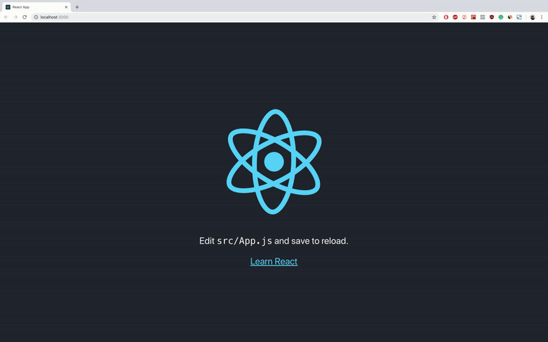

# Как использовать Redux в ReactJS с реальными примерами.


## Создание нового проекта на основе ReactJS и добавление в него Redux.

Перво-наперво давайте создадим новое  react-приложение, перейдем к нему и запустим.

```
create-react-app react-redux-tutorial
cd react-redux-tutorial
npm start
```

<center><small>вывод по умолчанию create-react-app после npm start</small></center>

Как мы видим, приложение create-react-app приложение предоставляет нам очень простой шаблон с абзацем текста, ссфлкой и привязкой к веб-сайту React, с вращением официального значка ReactJS.

Друзья, я не сказал вам, для чего мы будем использовать Redux, или что мы здесь делаем. И это потому, что мне нужно изображение GIF выше.

Чтобы сделать эту учебную статью легкой и понятной, мы не собираемся создавать что-то очень сложное. Мы будем использовать Redux, чтобы изображение React остановилось или начало вращаться.

Итак, как говорится, давайте продолжим и добавим следующие пакеты Redux:

```
npm install --save redux react-redux
```
### [redux v4.0.1](https://redux.js.org/)

* В общем смысле Redux делает то, что он создает глобальное состояние для всего приложения, к которому может обращаться любой ваш компонент.
* Это библиотека управления состоянием.
* У вас есть только одно состояние для всего вашего приложения, а не состояния для каждого из ваших компонентов.

### [react-redux v5.1.1](https://www.npmjs.com/package/react-redux)

* Это используется для того, чтобы мы могли получить доступ к данным Redux и изменить их, отправив действия в Redux - на самом деле это не Redux, но мы получим.
* По официальной документации `state`: *позволяет компонентам React считывать данные из хранилища Redux и отправлять действия в хранилище для обновления данных.*

> ПРИМЕЧАНИЕ. Если у вас возникли проблемы с приведенной выше командой, попробуйте установить пакеты отдельно.

При работе с Redux вам понадобятся три основных момента:

* [actions](https://redux.js.org/basics/actions): это объекты, которые должны иметь два свойства, одно из которых описывает **тип действия**, а другое описывает, **что следует изменить** в состоянии приложения.

* [reducers](https://redux.js.org/basics/reducers): это функции, которые реализуют **поведение действий**. Они изменяют состояние приложения на основе описания действия и описания изменения состояния.

* [store](https://redux.js.org/basics/store): он объединяет actions и reducers, **удерживая и изменяя состояние** всего приложения - существует только одино хранилище - store.

Как я уже говорил выше, мы будем останавливать и оять запускать логотип React. Это означает, что нам понадобятся два действия:

1 — Linux / Mac commands
```
mkdir src/actions
touch src/actions/startAction.js
touch src/actions/stopAction.js
```
2 — Windows commands
```
mkdir src\actions
echo "" > src\actions\startAction.js
echo "" > src\actions\stopAction.js
```
Теперь давайте отредактируем файл `src/actions/startAction.js` следующим образом:

```javascript
export const startAction = {
  type: "rotate",
  payload: true
};
```
Итак, мы собираемся сказать нашему reducer, что тип действия - это вращение (rotate) логотипа React. И состояние поворота логотипа React должно быть изменено на `true` - мы хотим, чтобы логотип начал вращаться.

Теперь давайте отредактируем файл `src/actions/stopAction.js` следующим образом:

```javascript
export const stopAction = {
  type: "rotate",
  payload: false
};
```
Итак, мы собираемся сказать нашему reducer, что тип действия - это вращение (rotate) логотипа React. И состояние поворота логотипа React должно быть изменено на `false`- мы хотим, чтобы логотип перестал вращаться.

Давайте также создадим reducer для нашего приложения:

1 — Linux / Mac commands
```
mkdir src/reducers
touch src/reducers/rotateReducer.js
```
2 — Windows commands
```
mkdir src\reducers
echo "" > src\reducers\rotateReducer.js
```
И добавьте в него следующий код:

```javascript
export default (state, action) => {
  switch (action.type) {
    case "rotate":
      return {
        rotating: action.payload
      };
    default:
      return state;
  }
};
```
Таким образом, редуктор получит оба наших действия, оба из которых имеют тип `rotate`, и они оба изменяют одно и то же состояние в приложении - которое является `state.rotating`. В зависимости от полезности этих действий `state.rotating` изменится на `true` или `false`.

Я добавил `default` case, который будет сохранять состояние неизменным, если тип действия не `rotate`. Значение по умолчанию есть в случае, если мы создаем действие, и мы забываем добавить `case`- случай для этого действия. Таким образом, мы не удаляем все состояние приложения - мы просто ничего не делаем и сохраняем то, что имели.

