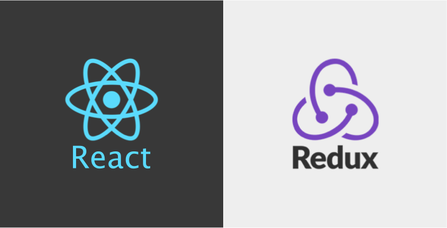

# Как использовать Redux в ReactJS с реальными примерами.



## Создание нового проекта на основе ReactJS и добавление в него Redux.

Перво-наперво давайте создадим новое  react-приложение, перейдем к нему и запустим.

```
create-react-app react-redux-tutorial
cd react-redux-tutorial
npm start
```

<center><small>вывод по умолчанию create-react-app после npm start</small></center>

Как мы видим, приложение create-react-app приложение предоставляет нам очень простой шаблон с абзацем текста, ссфлкой и привязкой к веб-сайту React, с вращением официального значка ReactJS.

Друзья, я не сказал вам, для чего мы будем использовать Redux, или что мы здесь делаем. И это потому, что мне нужно изображение GIF выше.

Чтобы сделать эту учебную статью легкой и понятной, мы не собираемся создавать что-то очень сложное. Мы будем использовать Redux, чтобы изображение React остановилось или начало вращаться.

Итак, как говорится, давайте продолжим и добавим следующие пакеты Redux:

```
npm install --save redux react-redux
```