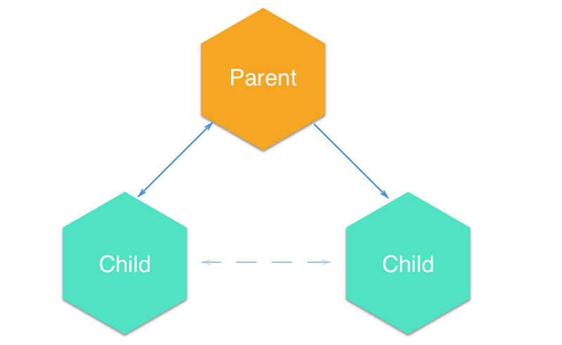

# Коммуникация между сестринскими компонентами в React без использования Redux.


Redux - это здорово, но мы также должны знать основы, прежде чем использовать какой-либо фреймворк или библиотеку, верно? Это то, что я делал до того, как начал изучать начальную загрузку и делал то же самое с Redux и ReactJ. Итак, эта статья посвящена созданию базового канала связи между братьями и сестрами с использованием только ReactJ.

Давайте обсудим требования. Мое приложение имеет дочерний компонент, который должен взаимодействовать со своим одноуровневым компонентом. Так что это должно происходить через Parent-component (родительский компонент) с методом Callback от parent-родителя до child1, который получит значение из child1 и передаст его другому потомку как `props`.
Просто, не правда ли?

## Поток данных.


<small><center>Поток передачи данных</center></small>

Поток
Требование: Child1 имеет поле ввода, при вводе этого значения необходимо отправить его компоненту child2 через Parent.

## Parent Component - Родительский компонент.
Сначала определите функцию обратного вызова - **Callback function** в `Parent` и отправьте ее как реквизиты - `props` для `Child1`.

```javascript
constructor(){
  super();
  this.state= {
    data : ""
  }
}
formChild1(params) {
  this.setState({
    data : params
  })
}
```

Я установил переменную состояния `state` данных -`data` и обновил ее значение, используя функцию обратного вызова `fromChild1` и отправив значение состояния `Child2`. 

*Зачем использовать `state`? Потому что реквизиты -`props` являются неизменными, и всегда лучше передать состояние в качестве `props`. И если вы хотите передать статические данные, всегда используйте `props`. Используйте состояние - `state` для передачи динамических данных.*

```javascript
render() {
  return(
    <div>
      <p>Parent</p>
    <Child callback={this.formChild1.bind(this)} />
    <Child2 data={this.state.data} />
    </div>
  );
}
```
## Child-1.


