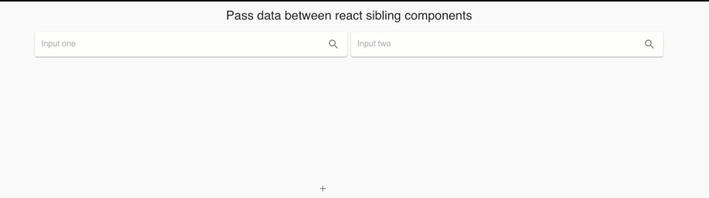
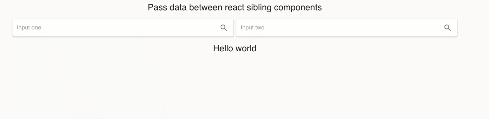
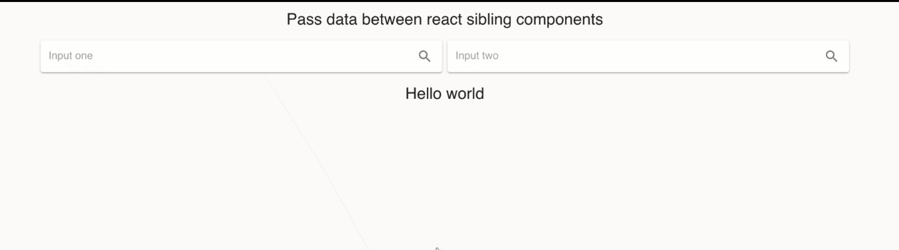

# Передача данных между родственными компонентами в React с использованием Context API и React Hooks.

Я создам простое react-приложение с 2-мя полями ввода - `input`, где их значения будут полностью синхронизированы. В этой статье я объясню, как легко передавать данные между одноуровневыми компонентами React, используя самые последние react - функции.


## Настраиваем среду React.
Чтобы запустить новое приложение в реакт, вам не нужно беспокоиться обо всех настройках и зависимостях. Я буду использовать среду `Create React App`, которая довольно проста и хорошо документирована. Всю документацию об этом наборе инструментов вы можете найти [здесь](https://reactjs.org/docs/create-a-new-react-app.html).

Создадим проект.

```javascript
npx create-react-app sync_inputs
```
После этого вам нужно перейти в папку `sync_inputs` и запустить приложение.

```javascript
cd sync_inputs
npm start
```

***Примечание***. У вас могут возникнуть проблемы с запуском этого локального сервера. Если у вас есть сообщение об ошибке, например `«Attempting to bind to HOST environment variable: x86_64-apple-darwin13.4.0 »`, [эта статья](https://medium.com/@choy/fixing-create-react-app-when-npm-fails-to-start-because-your-host-environment-variable-is-being-4c8a9fa0b461) может оказаться полезной для вас. Когда я пытался запустить свой сервер, у меня была ошибка `TypeError: fsevents is not a constructor.`. Я нашел много советов, как с этим справиться [здесь](https://github.com/facebook/create-react-app/issues/6891), но лично для меня помогло удаление всех пакетов Node и снова запустить `npm install`. После этого я запускаю `npm start` и все работает. Также использование npm не обязательно. Вы можете использовать `yarn`, если вам он нравится больше.

>Для пользователей Windows все проблемы с установкой и запуском `create-react-app` 3 версии, я описал в своем посте [здесь](https://github.com/YaroslavW/react-short-notes/blob/master/texts/news_in_create_react_app3/Create-react-app-news.md#%D0%BF%D0%BE%D1%81%D0%BB%D0%B5-%D0%BF%D0%BE%D1%81%D0%BB%D0%B5%D0%B4%D0%BD%D0%B8%D1%85-%D0%BE%D0%B1%D0%BD%D0%BE%D0%B2%D0%BB%D0%B5%D0%BD%D0%B8%D0%B9-creat-react-app-%D0%BD%D0%B5-%D0%B7%D0%B0%D0%BF%D1%83%D1%81%D0%BA%D0%B0%D0%B5%D1%82%D1%81%D1%8F). Там вы найдете все возможные причины и самые простые срособы решения, включая готовую, рабочую сборку стартового приложения, если вам ничего из этого не помогло.

Если все установлено и ваш локальный сервер работает, вам нужно перейти по адресу [http://localhost:3000](http://localhost:3000), и вы должны увидеть логотип реакт на темном фоне. Что-то вроде того:


Теперь остановите локальный сервер, нажав `Ctrl + C` в вашем терминале и установите еще пару зависимостей.

Установите базовую библиотеку [Material UI](https://material-ui.com/) и  icon library для создания приятного интерфейса.

```javascript
npm install @material-ui/core
npm install @material-ui/icons
```
Теперь ваш файл `package.json` должен выглядеть так:

```json
{
  "name": "sync_inputs",
  "version": "0.1.0",
  "private": true,
  "dependencies": {
    "@material-ui/core": "^4.5.0",
    "@material-ui/icons": "^4.4.3",
    "react": "^16.10.2",
    "react-dom": "^16.10.2",
    "react-scripts": "3.2.0"
  },
  "scripts": {
    "start": "react-scripts start",
    "build": "react-scripts build",
    "test": "react-scripts test",
    "eject": "react-scripts eject"
  },
  "eslintConfig": {
    "extends": "react-app"
  },
  "browserslist": {
    "production": [
      ">0.2%",
      "not dead",
      "not op_mini all"
    ],
    "development": [
      "last 1 chrome version",
      "last 1 firefox version",
      "last 1 safari version"
    ]
  }
}
```

Итак, теперь у нас есть рабочая среда со всеми библиотеками, которые нам нужны. Теперь пришло время начать строить наше приложение.

***
## Создаём компоненты React.

> *В этой части я настрою структуру нашего проекта и создам весь пользовательский интерфейс.*

Сначала создайте новые компоненты папок в каталоге `./src` нашего проекта. После этого в `./src/components` создайте два новых компонента (`Input_one.js`, `Input_two.js`). После всех этих шагов структура вашего проекта должна выглядеть так:


На следующих шагах я изменю наши компоненты, чтобы создать приятный интерфейс.

Измените `./src/components/Input_one.js`, чтобы создать первый инпут.

```javascript
import React from 'react';
import {makeStyles} from "@material-ui/core/styles/index";

//Material UI components
import Grid from '@material-ui/core/Grid';
import Paper from '@material-ui/core/Paper';
import InputBase from '@material-ui/core/InputBase';

//Material UI Icons
import IconButton from '@material-ui/core/IconButton';
import SearchIcon from '@material-ui/icons/Search';

const useStyles = makeStyles({
    root: {
        padding: '2px 4px',
        display: 'flex',
        alignItems: 'center',
        width: '100%',
    },
    input: {
        marginLeft: '8px',
        flex: 1,
    },
    iconButton: {
        padding: 10,
    }
});

export default function Input_one() {
    const classes = useStyles();

    return(
        <React.Fragment>
            <Grid item xs={12} md={6}>
                <Paper className={classes.root}>
                    <InputBase
                        className={classes.input}
                        placeholder="Input one"
                    />
                    <IconButton className={classes.iconButton} aria-label="search">
                        <SearchIcon />
                    </IconButton>
                </Paper>
            </Grid>
        </React.Fragment>
    )
}
```
Измените `./src/components/Input_two.js`, чтобы создать второй инпут.

```javascript
import React from 'react';
import {makeStyles} from "@material-ui/core/styles/index";

//Material UI components
import Grid from '@material-ui/core/Grid';
import Paper from '@material-ui/core/Paper';
import InputBase from '@material-ui/core/InputBase';

//Material UI Icons
import IconButton from '@material-ui/core/IconButton';
import SearchIcon from '@material-ui/icons/Search';

const useStyles = makeStyles({
    root: {
        padding: '2px 4px',
        display: 'flex',
        alignItems: 'center',
        width: '100%',
    },
    input: {
        marginLeft: '8px',
        flex: 1,
    },
    iconButton: {
        padding: 10,
    }
});

export default function Input_two() {
    const classes = useStyles();

    return(
        <React.Fragment>
            <Grid item xs={12} md={6}>
                <Paper className={classes.root}>
                    <InputBase
                        className={classes.input}
                        placeholder="Input two"
                    />
                    <IconButton className={classes.iconButton} aria-label="search">
                        <SearchIcon />
                    </IconButton>
                </Paper>
            </Grid>
        </React.Fragment>
    )
}
```
***Примечание***. Компоненты `Input_one` и `Input_two` практически одинаковы. Теперь главное отличие  `export default function Input_one()` и  `export default function Input_two()`.

Теперь измените файл `./src/App.js`. В этом файле я создам Контейнер -`Container`, где будет храниться весь контент нашего приложения, добавлю заголовок и импортирую наши компоненты `<Input_one />` и `<Input_two />`.

```javascript
import React from 'react';
import { makeStyles } from '@material-ui/core/styles';

//Material UI components
import Container from '@material-ui/core/Container';
import Typography from '@material-ui/core/Typography';
import Grid from '@material-ui/core/Grid';
import CssBaseline from '@material-ui/core/CssBaseline';
import Toolbar from '@material-ui/core/Toolbar';

//Import our Inputs
import Input_one from './components/Input_one';
import Input_two from './components/Input_two';

//Styles
const useStyles = makeStyles({
    toolbarTitle: {
        flex: 1,
    },
});

function App() {

  const classes = useStyles();

  return (
      <Container maxWidth="lg">
          <CssBaseline />

          {/*Title*/}
          <Toolbar>
              <Typography
                  component="h2"
                  variant="h5"
                  color="inherit"
                  align="center"
                  noWrap
                  className={classes.toolbarTitle}
              >
                  Pass data between react sibling components
              </Typography>
          </Toolbar>

          {/*Inputs*/}
          <Grid container spacing={1}>
              <Input_one/>
              <Input_two/>
          </Grid>

      </Container>
  );
}

export default App;
```
После всех этих шагов перейдите по адресу [http://localhost:3000](http://localhost:3000). Наш проект должен выглядеть так:


## Создаём функциональность для передачи данных между компонентами.

Согласно [документации React](https://reactjs.org/docs/context.html)

>*Context  в основном используется, когда некоторые данные должны быть доступны для многих компонентов на разных уровнях вложенности*.

В `./src/App.js` создайте объект контекста.

```javascript
// Create context object
export const AppContext = React.createContext();
```
Затем установите начальное состояние объекта, где мы храним наши данные, которые должны быть доступны из обоих инпутов.

```javasript
// Set up Initial State
const initialState = {
    inputText: '',
};
```
Теперь создайте функцию `reducer`, которая будет обновлять наше начальное состояние каждый раз, когда значение любых инпутов будет изменено. Мы будем использовать эту функцию с `useReducer`.

```javascript
function reducer(state, action) {
    switch (action.type) {
        case 'UPDATE_INPUT':
            return {
                inputText: action.data
            };


        default:
            return initialState;
    }
}
```
Согласно [реакт-документации](https://reactjs.org/docs/hooks-reference.html#usereducer)

> *`useReducer` позволяет оптимизировать производительность для компонентов, которые запускают глубокие обновления, поскольку вы можете передавать диспетчеризацию вместо обратных вызовов.*

Сначала нам нужно импортировать `useReducer` из реакта. Так что теперь первая строка `./src/App.js` должна выглядеть так.

```javascript
import React, { useReducer } from 'react';
```
Теперь нам нужно инициализировать состояние `useReducer`. Самый простой способ - передать начальное состояние в качестве второго аргумента. Мы можем сделать это, добавив:

```javascript
const [state, dispatch] = useReducer(reducer, initialState);
```
И последняя часть в `./src/App.js` - это обернуть компоненты `<Input_one />` и `<Input_two />` в `AppContext.Provider`. Каждый объект Context поставляется с компонентом Provider React, который позволяет потребляющим компонентам подписываться на изменения контекста. Провайдеры могут быть вложенными, чтобы переопределять значения глубже в дереве.

Теперь `./src/App.js` должен выглядеть так:

```javascript
import React, { useReducer } from 'react';
import { makeStyles } from '@material-ui/core/styles';

//Material UI components
import Container from '@material-ui/core/Container';
import Typography from '@material-ui/core/Typography';
import Grid from '@material-ui/core/Grid';
import CssBaseline from '@material-ui/core/CssBaseline';
import Toolbar from '@material-ui/core/Toolbar';

//Import our Inputs
import Input_one from './components/Input_one';
import Input_two from './components/Input_two';

//Styles
const useStyles = makeStyles({
    toolbarTitle: {
        flex: 1,
    },
});

// Create context object
export const AppContext = React.createContext();

// Set up Initial State
const initialState = {

    inputText: '',

};

function reducer(state, action) {
    switch (action.type) {
        case 'UPDATE_INPUT':
            return {
                inputText: action.data
            };


        default:
            return initialState;
    }
}

function App() {

  const classes = useStyles();

  const [state, dispatch] = useReducer(reducer, initialState);

  return (
      <Container maxWidth="lg">
          <CssBaseline />

          {/*Title*/}
          <Toolbar>
              <Typography
                  component="h2"
                  variant="h5"
                  color="inherit"
                  align="center"
                  noWrap
                  className={classes.toolbarTitle}
              >
                  Pass data between react sibling components
              </Typography>
          </Toolbar>

          {/*Inputs*/}
          <Grid container spacing={1}>
              <AppContext.Provider value={{ state, dispatch }}>
                  <Input_one/>
                  <Input_two/>
              </AppContext.Provider>
          </Grid>

      </Container>
  );
}

export default App;
```
Теперь нам нужно изменить наши компоненты `<Input_one />` и `<Input_two />`.

Все последующие изменения будут полностью одинаковыми для обоих компонентов ввода. Сначала нам нужно импортировать `useContext` из реакт.

```javascript
import React, { useContext } from 'react';
```
Теперь нам нужно импортировать `AppContext` из компонента `App`.

```javascript
import { AppContext } from '../App'
```
Чтобы использовать наши значения состояния внутри компонента, нам нужно добавить
```javascript
const {state, dispatch} = useContext(AppContext);
```
Затем добавьте функцию, которая будет обновлять значение `inputText` состояния с помощью `dispatch`. Эта функция будет вызываться каждый раз, когда мы вводим что-либо в любой ввод.

```javascript
const changeInputValue = (newValue) => {

    dispatch({ type: 'UPDATE_INPUT', data: newValue,});
};
```
Теперь нам нужно установить значение для `state.inputText`, а событие `onChange` должно вызвать функцию `changeInputValue`.

Теперь `./src/components/Input_one.js` должен выглядеть так:

```javascript
import React, { useContext } from 'react';
import {makeStyles} from "@material-ui/core/styles/index";

//Material UI components
import Grid from '@material-ui/core/Grid';
import Paper from '@material-ui/core/Paper';
import InputBase from '@material-ui/core/InputBase';

//Material UI Icons
import IconButton from '@material-ui/core/IconButton';
import SearchIcon from '@material-ui/icons/Search';

// Import Context
import { AppContext } from '../App'

const useStyles = makeStyles({
    root: {
        padding: '2px 4px',
        display: 'flex',
        alignItems: 'center',
        width: '100%',
    },
    input: {
        marginLeft: '8px',
        flex: 1,
    },
    iconButton: {
        padding: 10,
    }
});

export default function Input_one() {

    const classes = useStyles();

    const {state, dispatch} = useContext(AppContext);

    const changeInputValue = (newValue) => {

        dispatch({ type: 'UPDATE_INPUT', data: newValue,});
    };

    return(
        <React.Fragment>
            <Grid item xs={12} md={6}>
                <Paper className={classes.root}>
                    <InputBase
                        className={classes.input}
                        placeholder="Input one"
                        value={state.inputText}
                        onChange={e => changeInputValue(e.target.value)}
                    />
                    <IconButton className={classes.iconButton} aria-label="search">
                        <SearchIcon />
                    </IconButton>
                </Paper>
            </Grid>
        </React.Fragment>
    )
}
```
И `./src/components/Input_two.js` должен выглядеть так:

```javascript
import React, { useContext } from 'react';
import {makeStyles} from "@material-ui/core/styles/index";

//Material UI components
import Grid from '@material-ui/core/Grid';
import Paper from '@material-ui/core/Paper';
import InputBase from '@material-ui/core/InputBase';

//Material UI Icons
import IconButton from '@material-ui/core/IconButton';
import SearchIcon from '@material-ui/icons/Search';


//Import Context
import { AppContext } from '../App'

const useStyles = makeStyles({
    root: {
        padding: '2px 4px',
        display: 'flex',
        alignItems: 'center',
        width: '100%',
    },
    input: {
        marginLeft: '8px',
        flex: 1,
    },
    iconButton: {
        padding: 10,
    }
});


export default function Input_two() {

    const classes = useStyles();

    const {state, dispatch} = useContext(AppContext);

    const changeInputValue = (newValue) => {

        dispatch({ type: 'UPDATE_INPUT', data: newValue,});
    };

    return(
        <React.Fragment>
            <Grid item xs={12} md={6}>
                <Paper className={classes.root}>
                    <InputBase
                        className={classes.input}
                        placeholder="Input two"
                        value={state.inputText}
                        onChange={e => changeInputValue(e.target.value)}
                    />
                    <IconButton className={classes.iconButton} aria-label="search">
                        <SearchIcon />
                    </IconButton>
                </Paper>
            </Grid>
        </React.Fragment>
    )
}
```
Теперь введите что-нибудь в любые поля ввода, и вы увидите, что оба ввода будут обновлены и будут содержать одинаковые значения.



## Добавим помощьник неизменяемости - immutability-helper.
Так что теперь наше приложение работает так, как мы ожидали. Но давайте обновим наше начальное состояние в `./src/App.js`, добавим еще одно значение и отобразим его на странице. Так что теперь наш объект `initialState` должен быть таким:

```javascript
// Set up Initial State
const initialState = {
    inputText: '',
    testText: 'Hello world'
};
```
Теперь давайте отобразим `testText` на нашей странице. Наш файл `./src/App.js` должен быть таким:

```javascript
import React, { useReducer } from 'react';
import { makeStyles } from '@material-ui/core/styles';

//Material UI components
import Container from '@material-ui/core/Container';
import Typography from '@material-ui/core/Typography';
import Grid from '@material-ui/core/Grid';
import CssBaseline from '@material-ui/core/CssBaseline';
import Toolbar from '@material-ui/core/Toolbar';

//Import our Inputs
import Input_one from './components/Input_one';
import Input_two from './components/Input_two';

//Styles
const useStyles = makeStyles({
    toolbarTitle: {
        flex: 1,
    },
});

// Create context object
export const AppContext = React.createContext();

// Set up Initial State
const initialState = {

    inputText: '',
    testText: 'Hello world'

};

function reducer(state, action) {
    switch (action.type) {
        case 'UPDATE_INPUT':
            return {
                inputText: action.data
            };


        default:
            return initialState;
    }
}

function App() {

  const classes = useStyles();

  const [state, dispatch] = useReducer(reducer, initialState);

  return (
      <Container maxWidth="lg">
          <CssBaseline />

          {/*Title*/}
          <Toolbar>
              <Typography
                  component="h2"
                  variant="h5"
                  color="inherit"
                  align="center"
                  noWrap
                  className={classes.toolbarTitle}
              >
                  Pass data between react sibling components
              </Typography>
          </Toolbar>

          {/*Inputs*/}
          <Grid container spacing={1}>
              <AppContext.Provider value={{ state, dispatch }}>
                  <Input_one/>
                  <Input_two/>
              </AppContext.Provider>
          </Grid>

          {/*display testText value*/}
          <Toolbar>
              <Typography
                  component="h2"
                  variant="h5"
                  color="inherit"
                  align="center"
                  noWrap
                  className={classes.toolbarTitle}
              >
                  {state.testText}
              </Typography>
          </Toolbar>
      </Container>
  );
}

export default App;
```
Если все правильно, вы должны увидеть текст «Hello world» под нашими входными данными. Начните вводить что-либо в любой ввод. Вы можете увидеть, что случилось. Наш текст "Hello word" исчез.



Это произошло потому, что в настоящее время каждый раз, когда вы что-то печатаете в любом вводе, вы полностью заменяете наш `initialState` объект просто новым состоянием `inputText`. Но есть решение, чтобы это исправить. Нам не нужно каждый раз заменять объект `initialState`, нам просто нужно обновить значение `inputText` и не затрагивать другие состояния. Чтобы это произошло, мы можем использовать библиотеку- [immutability-helper](https://github.com/kolodny/immutability-helper)-, которая очень хорошо документирована. Установите эту библиотеку, набрав команду в вашем терминале.

```javascript
npm install immutability-helper --save
```
Теперь нам нужно просто импортировать эту библиотеку в наш файл `./src/App.js` и обновить функцию редуктора в соответствии с документацией ***immutability-helper***. Итак, наш файл `./src/App.js` должен выглядеть так:

```javascript
import React, { useReducer } from 'react';
import { makeStyles } from '@material-ui/core/styles';

//Import immutability-helper
import update from 'immutability-helper';

//Material UI components
import Container from '@material-ui/core/Container';
import Typography from '@material-ui/core/Typography';
import Grid from '@material-ui/core/Grid';
import CssBaseline from '@material-ui/core/CssBaseline';
import Toolbar from '@material-ui/core/Toolbar';

//Import our Inputs
import Input_one from './components/Input_one';
import Input_two from './components/Input_two';

//Styles
const useStyles = makeStyles({
    toolbarTitle: {
        flex: 1,
    },
});

// Create context object
export const AppContext = React.createContext();

// Set up Initial State
const initialState = {

    inputText: '',
    testText: 'Hello world'

};

function reducer(state, action) {
    switch (action.type) {
        case 'UPDATE_INPUT':
            return update(state, { inputText: {$set: action.data}});


        default:
            return initialState;
    }
}

function App() {

  const classes = useStyles();

  const [state, dispatch] = useReducer(reducer, initialState);

  return (
      <Container maxWidth="lg">
          <CssBaseline />

          {/*Title*/}
          <Toolbar>
              <Typography
                  component="h2"
                  variant="h5"
                  color="inherit"
                  align="center"
                  noWrap
                  className={classes.toolbarTitle}
              >
                  Pass data between react sibling components
              </Typography>
          </Toolbar>

          {/*Inputs*/}
          <Grid container spacing={1}>
              <AppContext.Provider value={{ state, dispatch }}>
                  <Input_one/>
                  <Input_two/>
              </AppContext.Provider>
          </Grid>

          {/*display testText value*/}
          <Toolbar>
              <Typography
                  component="h2"
                  variant="h5"
                  color="inherit"
                  align="center"
                  noWrap
                  className={classes.toolbarTitle}
              >
                  {state.testText}
              </Typography>
          </Toolbar>
      </Container>
  );
}

export default App;
```
Когда вы внесете эти изменения, ваше приложение должно работать как положено. Если вы введете что-то в любой ввод, заголовок «Hello world» все равно должен быть на странице. Теперь мы обновляем только те значения, с которыми работаем, а ***НЕ заменяем весь объект***.



